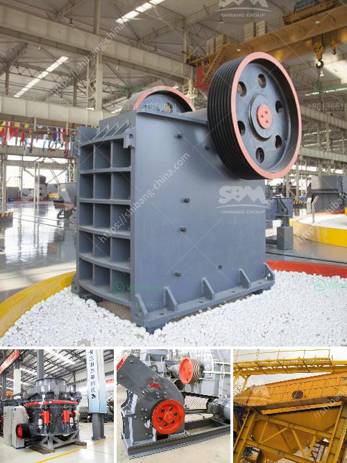

<h3>price of ceramic making machine in india</h3>
If you are planning to venture into the ceramic industry in India, one of the essential investments you need to consider is a ceramic making machine. This machine plays a crucial role in the production of ceramic products, ensuring efficiency and quality. However, before making this investment, it is essential to understand the price range of ceramic making machines available in the Indian market.

The price of a ceramic making machine in India varies depending on various factors such as brand, capacity, features, and technical specifications. On average, you can expect to find a wide range of machines with prices ranging from INR 10,000 to INR 50,00,000.

At the lower end of the spectrum, you will find small-scale, semi-automatic machines that are suitable for startups or individuals looking to produce ceramic products on a small scale. These machines typically have a lower capacity and limited features but are ideal for those with budget constraints. Their prices generally fall within the range of INR 10,000 to INR 1,00,000.

As you move towards the higher end of the price range, you will find machines with advanced features that offer greater productivity and efficiency. These machines are usually fully automatic and have a higher production capacity, making them suitable for medium to large-scale ceramic production. Their prices can range from INR 1,00,000 to INR 50,00,000 or more.

It is important to note that the prices mentioned here are indicative and can vary significantly based on factors such as brand reputation, additional features, quality of materials used, and after-sales service offered by the manufacturer.

Before finalizing your purchase, it is advisable to thoroughly research different brands, compare prices, and consider the specific requirements of your ceramic production. Additionally, consider seeking recommendations from industry experts or consulting with manufacturers to ensure you find a machine that meets your needs and budget.

Investing in a ceramic making machine in India is a significant step towards establishing a successful ceramic business. By carefully considering the price range and choosing a reliable machine, you can gain a competitive edge in the industry and ensure the long-term success of your venture.
<h3>Contact us</h3><ul><li><strong>Whatsapp:&nbsp;<a href="https://wa.me/8613661969651">+8613661969651</a></strong></li><li><a href="https://swt.shibang-china.com/?git&amp;zhl&amp;price of ceramic making machine in india"><strong>Online Service(chat now)</strong></a></li></ul><h3>Related</h3><ul><li><a href='impact crushers for sale in usa.md'>impact crushers for sale in usa</a></li><li><a href='stone mining crusher in jharkhand.md'>stone mining crusher in jharkhand</a></li><li><a href='stone crusher application.md'>stone crusher application</a></li><li><a href='belt conveyor for stone aggregate.md'>belt conveyor for stone aggregate</a></li><li><a href='the gold mining process in zimbabwe.md'>the gold mining process in zimbabwe</a></li></ul>