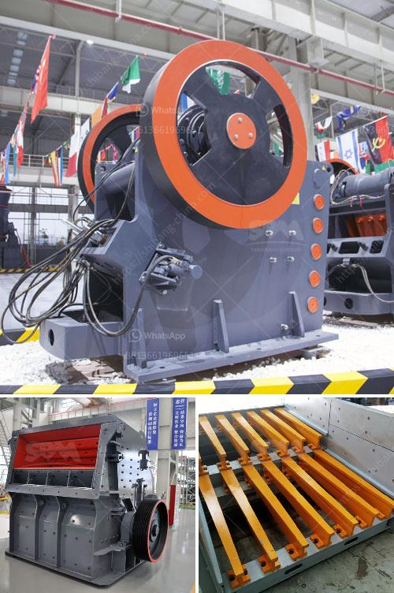

<h3>price of gypsum plant machines</h3>
Gypsum, also known as calcium sulfate dihydrate, is a soft mineral that is commonly used in construction materials. It is a key component in the production of plaster, drywall, and other building materials. As the demand for gypsum continues to rise, manufacturers have been investing in gypsum plant machines to meet the market needs. However, one crucial aspect that potential buyers often consider is the price of these machines. In this article, we will delve into the factors that affect the price of gypsum plant machines.

First and foremost, the scale of the plant plays a significant role in determining the price. Gypsum plant machines come in varying sizes and capacities, ranging from small-scale operations to large industrial plants. Naturally, larger machines with higher production capacities tend to be more expensive than their smaller counterparts. The size of the plant depends on various factors such as the expected demand, available resources, and budget of the buyer. It is imperative to carefully assess the requirements of the project to ensure that the chosen machine size is suitable.

Another factor that affects the price is the level of automation and technology incorporated in the machines. Modern gypsum plant machines feature advanced automation systems that streamline the production process and improve overall efficiency. These machines often come with computerized controls, digital monitoring systems, and robotic components. While the integration of advanced technology enhances productivity and reduces labor costs, it also contributes to a higher price tag. Buyers must carefully consider their budget and the level of automation they require before making a purchase decision.

The quality and durability of the machines also impact the price. Gypsum plant machines are subjected to harsh operational conditions, dealing with high temperatures, abrasive materials, and continuous use. Consequently, manufacturers invest in high-quality materials, such as stainless steel and specialized alloys, to ensure the machines can withstand these conditions. The use of premium materials, along with sturdy construction and rigorous quality control, leads to a higher price for these machines. However, investing in durable machines can result in long-term cost savings through reduced maintenance and downtime costs.

Moreover, the reputation and expertise of the manufacturer also influence the price of gypsum plant machines. Established manufacturers with a track record of delivering reliable and high-quality machines often charge a premium for their products. Their extensive knowledge and experience in the gypsum industry allow them to engineer machines that are efficient, durable, and reliable. While it may be tempting to opt for cheaper machines from lesser-known manufacturers, buyers must exercise caution and thoroughly research the credentials and reputation of any prospective manufacturer.

In conclusion, the price of gypsum plant machines is determined by various factors, including the size of the plant, the level of automation, the quality of materials, and the reputation of the manufacturer. Buyers must carefully consider their project requirements, budget, and long-term goals to make an informed decision. It is advisable to consult with industry experts, compare multiple manufacturers, and evaluate the benefits and drawbacks of each machine before making a final purchase. By understanding the factors that contribute to the price, buyers can make smart choices that align with their needs and budget.
<h3>Contact us</h3><ul><li><strong>Whatsapp:&nbsp;<a href="https://wa.me/8613661969651">+8613661969651</a></strong></li><li><a href="https://swt.shibang-china.com/?git&amp;zhl&amp;price of gypsum plant machines"><strong>Online Service(chat now)</strong></a></li></ul><h3>Related</h3><ul><li><a href='steel casting mining machinery parts wedge plate.md'>steel casting mining machinery parts wedge plate</a></li><li><a href='industrial ball mills.md'>industrial ball mills</a></li><li><a href='high pressure grinding roll pictures.md'>high pressure grinding roll pictures</a></li><li><a href='raymond mill in india.md'>raymond mill in india</a></li><li><a href='second hand diamond dms plant for sale kimberly.md'>second hand diamond dms plant for sale kimberly</a></li></ul>