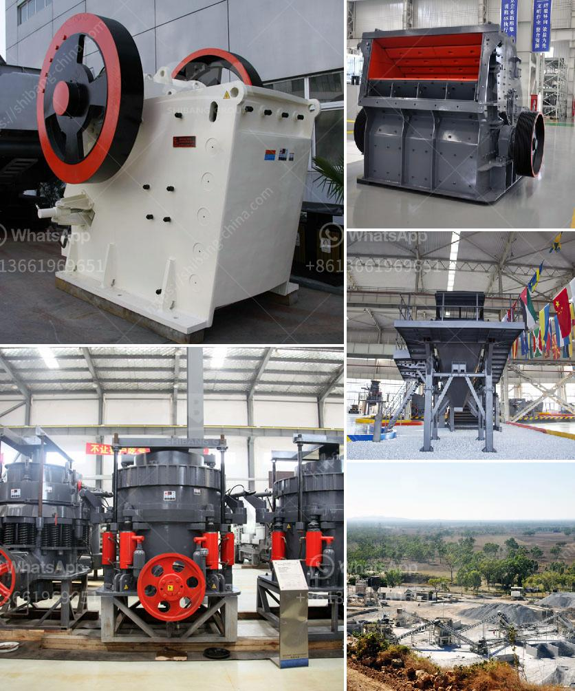

<h3>price of hammer mill</h3>
If you are in the market for a versatile and efficient hammer mill, one that can be used for agricultural purposes, manufacturing materials, or even recycling, then you may be wondering about its price. Hammer mills are specialized machines that grind and pulverize materials into small particles, making them essential for a variety of industries. In this article, we will explore the factors that influence the price of a hammer mill and why it is an investment worth considering.

Firstly, the price of a hammer mill varies depending on its size and capacity. Typically, hammer mills come in different sizes, ranging from small handheld models to large industrial machines. The size and capacity of the hammer mill determine the amount of material it can process at once, with larger mills being able to handle higher volumes. As a result, larger hammer mills tend to be more expensive due to their higher production capabilities.

Secondly, the price of a hammer mill is influenced by its construction and build quality. Hammer mills are subject to heavy wear and tear, as they are designed to process tough materials. Therefore, it is crucial to invest in a hammer mill made with durable materials, such as hardened steel, to ensure its longevity and reduce maintenance costs. Superior build quality often comes at a higher price, but it pays off in terms of reliability and long-term savings.

Another factor that affects the price of a hammer mill is its power source. Hammer mills can be powered by electricity, diesel, or even gasoline engines. The power source you choose depends on your specific needs and preferences. While electric and diesel-powered hammer mills tend to have higher initial costs, they are more energy-efficient and environmentally friendly in the long run. On the other hand, gasoline-powered hammer mills may be more affordable upfront but come with higher operating costs.

Additionally, the price of a hammer mill may also include additional features and customization options. For example, some manufacturers offer hammer mills with built-in screens or interchangeable screen sizes, allowing you to adjust the particle size of the output material. This feature can be particularly beneficial if you need materials of different sizes for various applications. Customization options, such as the ability to choose between different rotor designs or material feeding mechanisms, can also impact the price of a hammer mill.

While the price of a hammer mill may seem steep at first glance, it is essential to consider the long-term benefits and potential returns on investment. A hammer mill can significantly improve your workflow efficiency, reduce labor costs, and increase the profitability of your business. The versatility of a hammer mill also means it can be used for various applications, ensuring that your investment remains viable even if your needs change over time.

In conclusion, the price of a hammer mill can vary based on several factors, including size, capacity, construction, power source, and additional features. However, when considering the investment in a hammer mill, it is crucial to weigh the upfront cost against the long-term benefits it offers. The ability to process materials efficiently and the potential for increased productivity make a hammer mill worth considering for businesses across a wide range of industries.
<h3>Contact us</h3><ul><li><strong>Whatsapp:&nbsp;<a href="https://wa.me/8613661969651">+8613661969651</a></strong></li><li><a href="https://swt.shibang-china.com/?git&amp;zhl&amp;price of hammer mill"><strong>Online Service(chat now)</strong></a></li></ul><h3>Related</h3><ul><li><a href='fine powder grinder commercial.md'>fine powder grinder commercial</a></li><li><a href='copper crusher price.md'>copper crusher price</a></li><li><a href='mobile crushing machine sales in south africa.md'>mobile crushing machine sales in south africa</a></li><li><a href='models of stone crushers in malaysia.md'>models of stone crushers in malaysia</a></li><li><a href='drywall grinding for gypsum.md'>drywall grinding for gypsum</a></li></ul>