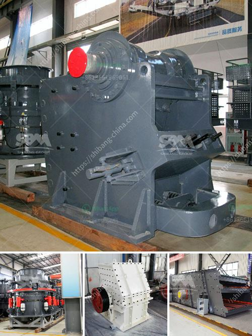

<h3>price of marble grinder mill</h3>
Marble is a metamorphic rock that is formed from limestone under high pressure and heat conditions in the Earth's crust. It is known for its beautiful appearance and has been used for centuries in various construction and decorative applications. To enhance the functionality and durability of marble, it often needs to be processed into smaller particles using a marble grinder mill.

A marble grinder mill, also known as a marble grinding mill, is a type of equipment used for marble grinding. It uses steel balls as the grinding medium, which can effectively grind and crush the marble to produce different fineness of powder. The marble grinder mill is widely used in marble processing industries, such as in the construction, metallurgy, chemical, and mining industries.

When it comes to the price of a marble grinder mill, there are several factors that contribute to the final cost. These factors include the machine quality, the grinding capacity, the grinding fineness, and the machine manufacturer.

Firstly, the quality of the marble grinder mill plays a significant role in determining its price. High-quality machines are usually made of high-quality materials, such as stainless steel or alloy steel, which are more expensive than regular materials. These machines are also manufactured using advanced technologies, ensuring their durability and excellent performance. Therefore, purchasing a high-quality marble grinder mill may be more expensive initially, but it can save you money in the long run due to its longer lifespan and lower maintenance costs.

Secondly, the grinding capacity of the marble grinder mill affects its price. Different machines have different grinding capacities, ranging from a few kilograms per hour to hundreds of kilograms per hour. The higher the grinding capacity, the higher the price of the machine. Therefore, it is important to determine your specific needs and choose a machine that suits your production requirements.

Thirdly, the grinding fineness also impacts the price of the marble grinder mill. Finer grinding requires more time and energy, as well as more sophisticated grinding mechanisms, which can influence the overall cost of the machine. If you are looking to produce a fine and uniform marble powder, you may need to invest in a more expensive grinder mill that provides finer grinding capabilities.

Lastly, the reputation and brand of the machine manufacturer can affect the price of the marble grinder mill. Well-known and reputable manufacturers typically sell their machines at a higher price due to their brand value, quality assurance, and after-sales service. While it may be tempting to opt for a cheaper alternative from a lesser-known manufacturer, it is crucial to consider the overall quality and reliability of the machine to ensure that you get value for your money.

In conclusion, the price of a marble grinder mill depends on various factors such as the machine quality, grinding capacity, grinding fineness, and the manufacturer's reputation. It is essential to carefully evaluate these factors and choose a machine that meets your specific requirements. Remember, investing in a high-quality marble grinder mill can result in better performance, durability, and overall satisfaction in the long run.
<h3>Contact us</h3><ul><li><strong>Whatsapp:&nbsp;<a href="https://wa.me/8613661969651">+8613661969651</a></strong></li><li><a href="https://swt.shibang-china.com/?git&amp;zhl&amp;price of marble grinder mill"><strong>Online Service(chat now)</strong></a></li></ul><h3>Related</h3><ul><li><a href='silica sand washing plant china.md'>silica sand washing plant china</a></li><li><a href='stone mining crusher in jharkhand.md'>stone mining crusher in jharkhand</a></li><li><a href='ball milling method in tamil.md'>ball milling method in tamil</a></li><li><a href='vibrating screen working principle.md'>vibrating screen working principle</a></li><li><a href='cost of granite crusher.md'>cost of granite crusher</a></li></ul>