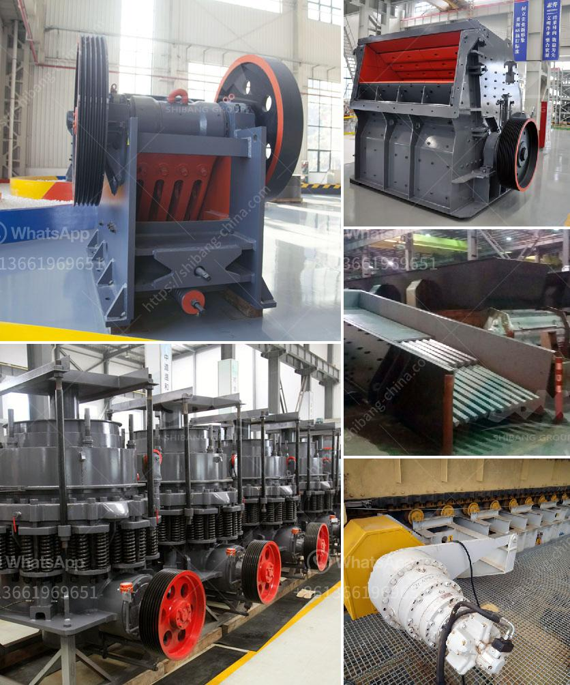

<h3>price of mining conveyor belt in south africa</h3>
The mining industry is a key sector in the economy of South Africa, and conveyor belts are crucial for transporting materials and products efficiently throughout the facility. With the constant demand for conveyor belts that can withstand the harsh mining environment, suppliers in South Africa have created a wide variety of conveyor belts with various specifications and features.

When it comes to the price of mining conveyor belts in South Africa, there are many factors that contribute to the final cost. The size and length of the belt required, the type and quality of materials used in its construction, the durability and load-bearing capacity, and additional features such as fire resistance and impact resistance all play a role in determining the price.

In South Africa, the price of mining conveyor belts ranges from around R1000 to R30000 per meter. Cost considerations must always be balanced against the valuable benefits that these conveyor belts provide, such as increased efficiency, reduced manual labor, and improved safety. Investing in high-quality conveyor belts with a higher price tag often pays off in the long run due to their longer lifespan and lower maintenance costs.

Another aspect that affects the price of mining conveyor belts is the supplier. With various suppliers across South Africa, it becomes crucial for mining companies to research and compare prices and quality before making a purchase. The reputation and experience of the supplier, as well as their after-sales service and support, should also be taken into account to ensure a smooth and trouble-free operation of the conveyor belts.

In conclusion, the price of mining conveyor belts in South Africa can vary significantly depending on factors such as size, materials used, durability, and additional features. Although cost is an important consideration, it is essential for mining companies to prioritize quality and reliability when selecting conveyor belts for their operations. Investing in high-quality belts may come with a higher initial price tag but can ultimately lead to improved efficiency, reduced downtime, and increased profitability.
<h3>Contact us</h3><ul><li><strong>Whatsapp:&nbsp;<a href="https://wa.me/8613661969651">+8613661969651</a></strong></li><li><a href="https://swt.shibang-china.com/?git&amp;zhl&amp;price of mining conveyor belt in south africa"><strong>Online Service(chat now)</strong></a></li></ul><h3>Related</h3><ul><li><a href='stone crushers mozambique.md'>stone crushers mozambique</a></li><li><a href='crusher screener forsale in sweden.md'>crusher screener forsale in sweden</a></li><li><a href='south africa manufacturer of mobile gold processing plant.md'>south africa manufacturer of mobile gold processing plant</a></li><li><a href='used stone crusher for sale in india.md'>used stone crusher for sale in india</a></li><li><a href='project cost of clinker grinding unit.md'>project cost of clinker grinding unit</a></li></ul>