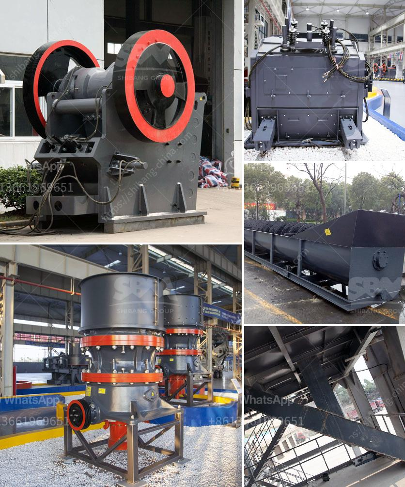

<h3>price of mobile stone crusher 100 200 tph</h3>
The mobile stone crusher 100 200 tph is a popular type of crushing equipment in many fields such as construction waste mining quarry and road construction. The price of mobile stone crusher 100 200 tph has different configurations, depend on the production requirements, and different models of machines. Demand for the capacity and type of stone crusher plant are the factors that affect the price of mobile stone crusher. Additionally, different manufacturers also have different prices due to their own manufacturing techniques, scale and profit margins.

The mobile stone crusher 100 200 tph has a conveyor belt that can be used to transport stones to the construction site. This machine is flexible to be driven anywhere even on the rough roads. The mobile stone crusher 100 200 tph has a large crushing ratio and is very suitable for crushing concrete, limestone, coal, basalt, granite and other ores. It is also widely used in construction waste, mining and other fields.

The mobile stone crusher 100 200 tph has a short chassis and can be easily driven on ordinary roads. It can flexibly switch between coarse and fine crushing modes, and adjust the position of the movable jaw to ensure the size of the finished material is suitable for subsequent crushing or sand making operations. The mobile stone crusher 100 200 tph can also be equipped with a portable screening device, which can be assembled on the machine to complete the crushing and screening operations at one time.

The mobile stone crusher 100 200 tph has the advantages of flexible configuration, strong crushing force, reliable performance, convenient operation and high efficiency. It is suitable for construction waste disposal, construction waste crushing and mining. This model can meet the requirements of coarse crushing, medium crushing, fine crushing and ultra-fine crushing. It can also be used in combination with other models to form a crushing production line with different capacities.

The price of mobile stone crusher 100 200 tph varies according to configuration requirements. The average price is about $60,000 to $250,000. Heavy Industry's mobile stone crusher capacity includes 50 tph, 100 tph, 120 tph, 180 tph, 200 tph, capacity and price. The common specifications of the finished product are 0-5mm, 5-10mm, 10-20mm, 20-30mm, 30-40mm, etc. These specifications can meet the requirements of different users. If you need specific information about mobile stone crusher 100 200 tph, please leave a message on the website or contact our online customer service. We will answer your questions in time.

In conclusion, the mobile stone crusher 100 200 tph has excellent performance, high production efficiency, large crushing ratio, and its advantages are mainly reflected in the following aspects: 1. Quality assurance, reasonable price; 2. Full range of crushing parameters, easy to operate; 3. Easy to transport, flexible configuration; 4. Energy saving and environmental protection, low carbon and green production. With these advantages, the mobile stone crusher 100 200 tph is warmly welcomed by construction waste disposal and mining investors.
<h3>Contact us</h3><ul><li><strong>Whatsapp:&nbsp;<a href="https://wa.me/8613661969651">+8613661969651</a></strong></li><li><a href="https://swt.shibang-china.com/?git&amp;zhl&amp;price of mobile stone crusher 100 200 tph"><strong>Online Service(chat now)</strong></a></li></ul><h3>Related</h3><ul><li><a href='jaw crusher machine in south africa.md'>jaw crusher machine in south africa</a></li><li><a href='raymond mills in india.md'>raymond mills in india</a></li><li><a href='jaw crusher typex.md'>jaw crusher typex</a></li><li><a href='ballast crusher for sale in kenya.md'>ballast crusher for sale in kenya</a></li><li><a href='price of a vibrating screen.md'>price of a vibrating screen</a></li></ul>