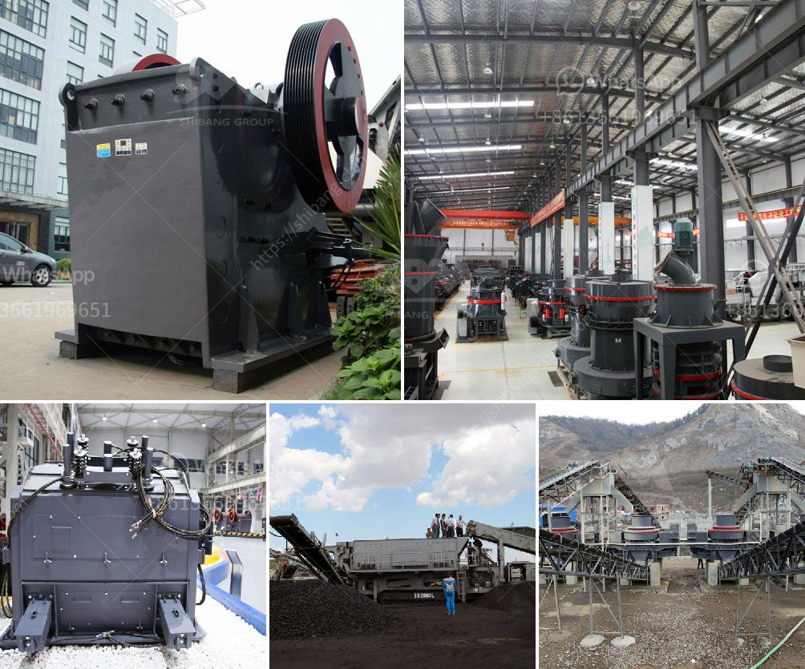

<h3>price of stone crusher from china</h3>
The price of stone crusher from China is not fixed. With different stone crusher manufacturers, the price will also vary. The quality, performance and lifespan of a machine will also affect its price. As the leading mining crusher manufacturer in China, we will provide factory price and maximum discount for you. Welcome to visit our factory and company in China.

Stone crusher machines have high crushing efficiency and high output. The product is cubic and suitable for railway and high way construction. The main parts are made of wear-resistant material, using renewable technology and wear-resistant materials. The maintenance cost is low. And the operation is simple, flexible and reliable.

The impact crusher crushing the soft and very hard materials, even if there is moisture in the material. The types of stone crushers are widely used in building materials, ore crushing, railways, highways, energy, transportation, energy, cement, mining, chemical and other industries for medium and fine crushing. Falling rock particles (rock fragments) produced by the crushing process are called stone chips, which should be included in the quotations of the stone factory.

The price of stone crushers is different in different regions. In the past years, the stone crushing equipment market has been developing very well in China. Since the reform and opening up, China's infrastructure construction industry and mining machinery industry have obtained rapid development. The demand for crushing machines is increasing. As a leading crusher manufacturer in China, we will provide maximum preferential price and discount for you.

Secondly, China is still in the period of rapid industrialization and urbanization. Therefore, the demand for building materials such as cement, concrete, and aggregate will continue to increase. In addition, there is a huge demand for sand and gravel aggregates in construction, water conservancy projects, transportation and other industries. The price of stone crushing equipment is influenced by various factors.

First: steel prices. Steel is the main raw material for making stone crushers, so the price fluctuation of steel prices has a very large impact on the price of equipment. The rise in steel prices will increase the production cost of the crusher manufacturers, so the price of the crusher will increase.

Second: the price of raw materials. Raw materials such as river pebbles, rocks (limestone, granite, basalt, diabase, andesite, etc.), ore tailings, stone chips, etc. are also a major factor affecting the price of crushing equipment. Level of crushing equipment price mainly manifested in steel prices, the production of stone crushers inclusively which factors.

Third: total output. In the current market, the crusher output is increasing, equipment is becoming more and more diversified. Customers only have the right environment to choose the right stone crusher manufacturer to match in India, so that the product is expected to achieve the desired results. As a machinery and equipment manufacturer, Liming Heavy Industry is one of the most important suppliers of mining machinery and equipment. The above is the analysis of the factors that affect the price of the stone crusher in China. The price of the stone crusher manufacturer in China is reasonable, so it is worthy of customer trust.

As a famous and professional stone crusher manufacturer, we can provide the most competitive price and cost-effective equipment for customers. Every stone crusher has its own advantages and characteristics, by crusher crush various materials, the cost of stone crusher plant in China is also very reasonable, so we provide you with the most cost-effective equipment, such as a PE jaw crusher, PF impact crusher, HPT hydraulic cone crusher, etc. These crushing machines can break the large scale stone ores into smaller size or even the fine powder size for further production line. All of these machines will be suggested in accordance with the specific requirements of materials and production line.
<h3>Contact us</h3><ul><li><strong>Whatsapp:&nbsp;<a href="https://wa.me/8613661969651">+8613661969651</a></strong></li><li><a href="https://swt.shibang-china.com/?git&amp;zhl&amp;price of stone crusher from china"><strong>Online Service(chat now)</strong></a></li></ul><h3>Related</h3><ul><li><a href='mobile crushing plant for sale.md'>mobile crushing plant for sale</a></li><li><a href='malaysia tin ore cursher supplier.md'>malaysia tin ore cursher supplier</a></li><li><a href='crushing and screening of manganese ore.md'>crushing and screening of manganese ore</a></li><li><a href='double roller stone cracher.md'>double roller stone cracher</a></li><li><a href='super fine powder mill.md'>super fine powder mill</a></li></ul>