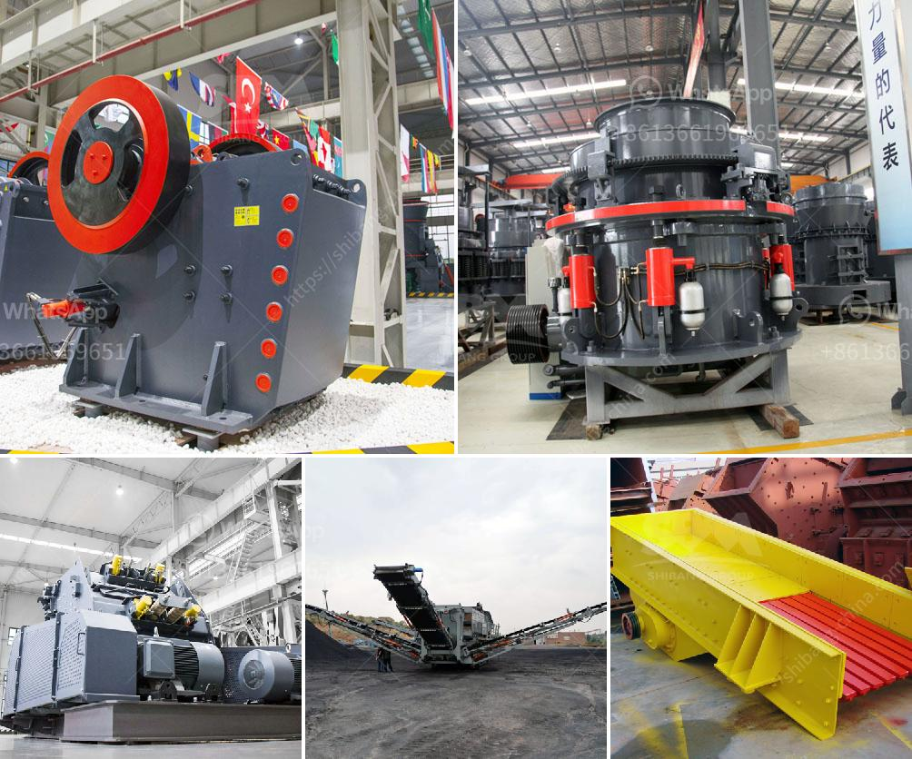

<h3>price on a jaw crusher in south africa</h3>
The price of a jaw crusher is based on the size of the machine or the stone size you need to crush, and the capacity that you need. Based on these factors, the price of a jaw crusher in South Africa can range from around $15,000 to $2,000,000.

The smaller size jaw crushers are priced lower because they may not have as high capacity as the larger ones. The materials that need to be crushed may also affect the price. For example, if you are crushing hard and abrasive stones, you may need a jaw crusher that has a high resistance to wear and tear. These types of jaw crushers may cost more.

Another factor that can affect the price is the brand of the jaw crusher. Some well-known brands have been in the market for many years and have established a reputation for producing high-quality and durable machines. These brands often command a higher price due to their reliability and performance.

It is also important to consider the after-sales service and support when purchasing a jaw crusher. Some manufacturers offer comprehensive support, including spare parts availability and on-site technical assistance. These additional services may come at an extra cost, and therefore, the price may be higher.

In South Africa, there are many suppliers and manufacturers of jaw crushers, such as Shanghai SBM Company. As a professional manufacturer and supplier of mining machines, SBM has been focusing on the research and development of mining equipment for more than 20 years. Their jaw crushers are engineered for long-lasting performance and are popular for their high productivity and efficiency.

When purchasing a jaw crusher, it is recommended to compare different suppliers and their offerings. Look for a supplier that offers good quality machines at a reasonable price. It is also important to check the warranty and after-sales support provided by the supplier.

In conclusion, the price of a jaw crusher in South Africa depends on multiple factors such as the size, capacity, materials to be crushed, brand, after-sales service, and support. It is important to compare different suppliers and choose a reliable and reputable supplier that offers good quality machines at a reasonable price. Investing in a high-quality jaw crusher can have a significant impact on your mining or construction operations, improving productivity and efficiency.
<h3>Contact us</h3><ul><li><strong>Whatsapp:&nbsp;<a href="https://wa.me/8613661969651">+8613661969651</a></strong></li><li><a href="https://swt.shibang-china.com/?git&amp;zhl&amp;price on a jaw crusher in south africa"><strong>Online Service(chat now)</strong></a></li></ul><h3>Related</h3><ul><li><a href='industrial application of pebble mill.md'>industrial application of pebble mill</a></li><li><a href='iron processing plant cost.md'>iron processing plant cost</a></li><li><a href='calcite grinding mill.md'>calcite grinding mill</a></li><li><a href='how to get aluminum from bauxite.md'>how to get aluminum from bauxite</a></li><li><a href='silica sand washing plant china.md'>silica sand washing plant china</a></li></ul>