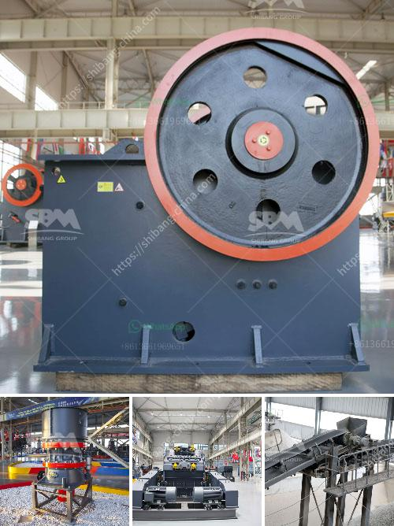

<h3>price pe 600 900 stone crusher</h3>
In recent years, construction and infrastructure projects have been on the rise, which means that there is a constant need for stone crusher machines. Over the years, manufacturers have developed advanced techniques and machinery to cater to the growing demand for stone aggregate. This is where the PE 600 900 jaw crusher comes into play as it is a vital part of many construction projects.

The jaw crusher is an essential piece of equipment when you are considering a construction project. It is a multi-purpose machine that is used for various crushing purposes. The primary aim of this machinery is to reduce oversized rocks or boulders into smaller pieces that can be used for different construction purposes. This can include applications such as road construction, building foundations, and railway track ballast.

One popular model of a jaw crusher is the PE 600 900 crusher. This type of machine is one of the most widely used crushing machines in mining and quarrying industries. This machine has a simple but sturdy construction making it a reliable tool for any purpose. With its strong jaw structure and high-quality components, it can easily crush stones of different hardness levels from soft limestone to hard granite.

A significant advantage of the PE 600 900 stone crusher is its low operating cost. This machine relies on a fuel-efficient engine that consumes low amounts of fuel. It has a powerful production capacity of up to 200 tons per hour, which translates to a lower cost per ton processed. This jaw crusher also requires less maintenance, reducing downtime and ensuring higher productivity on construction sites.

Another feature that makes the PE 600 900 stone crusher stand out is its ability to crush materials with high compression strength. This allows for efficient crushing of stones and rocks that are harder in nature. By adjusting the discharge opening, the machine can produce a variety of outputs, providing flexibility for different construction requirements.

One important aspect to consider when purchasing a stone crusher is its price. The price of a stone crusher depends on the type and model of the machine. As such, the PE 600 900 jaw crusher offers investors a great opportunity to own a reliable crushing tool at an affordable price. For example, it can be purchased at a low price and still maintain a strong production capacity. It is also worth noting that the price of this machine is highly competitive compared to similar models in the market.

In conclusion, the PE 600 900 stone crusher is a great investment asset in both the construction and mining industries. It is ideal for crushing materials with high hardness and excellent efficiency. Its low operating costs and competitive price make it a popular choice among construction project managers. So if you are looking for a reliable and affordable stone crusher, the PE 600 900 should be at the top of your list.
<h3>Contact us</h3><ul><li><strong>Whatsapp:&nbsp;<a href="https://wa.me/8613661969651">+8613661969651</a></strong></li><li><a href="https://swt.shibang-china.com/?git&amp;zhl&amp;price pe 600 900 stone crusher"><strong>Online Service(chat now)</strong></a></li></ul><h3>Related</h3><ul><li><a href='buy jaw crushers.md'>buy jaw crushers</a></li><li><a href='sale limestone crusher malaysia.md'>sale limestone crusher malaysia</a></li><li><a href='belt conveyor for stone aggregate.md'>belt conveyor for stone aggregate</a></li><li><a href='roller mill price.md'>roller mill price</a></li><li><a href='process of limestone mining to market.md'>process of limestone mining to market</a></li></ul>