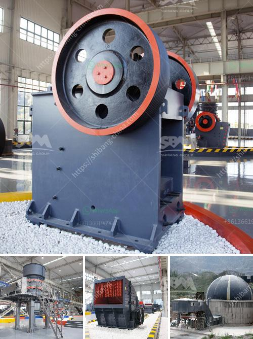

<h3>price phosphate rock crusher</h3>
Phosphate rock is a valuable mineral resource that is mainly used for the production of fertilizers. It is essential for plant growth and plays a vital role in increasing agricultural productivity. The demand for phosphate rock crusher is increasing, as the global population is growing and the need for food production is rising. Therefore, it is necessary to find an efficient and cost-effective way to crush phosphate rock.

The price of phosphate rock crusher is a concern for many customers. To find out the factors influencing the price, it is necessary to know some basic information about phosphate rock. The hardness, color, and composition of phosphate rock vary depending on the source. In general, phosphate rock is a sedimentary rock that contains high concentrations of phosphate minerals. The main minerals in phosphate rock are apatite, fluoroapatite, francolite, and wavellite.

The price of phosphate rock crusher depends on the size of the crusher, the features of the machine, and the hardness of the material. It also depends on the capacity and technical design of the machine. Today, there are several types of machines available for crushing phosphate rock, such as jaw crusher, cone crusher, impact crusher, and hammer crusher. These machines have different specifications and can be used for different purposes.

The price of phosphate rock crusher also varies depending on the region and the supplier. As a mineral resource, phosphate rock is not evenly distributed around the world. The largest producers of phosphate rock are China, the United States, Morocco, and Western Sahara. Therefore, the cost of transportation and import/export taxes can affect the final price of the crusher.

In recent years, there have been advancements in technology that have led to the development of more advanced and efficient crushers. These crushers have higher crushing efficiency and can produce more uniform and consistent product sizes. However, these advanced machines usually come with a higher price tag. It is essential to consider the cost-effectiveness and long-term benefits of investing in a higher-priced crusher.

When considering the price of phosphate rock crusher, it is also important to evaluate the after-sales service and warranty provided by the supplier. A reliable supplier should offer technical support, spare parts, and maintenance services to ensure the smooth operation and long lifespan of the machine. It is advisable to choose a reputable supplier with a good track record and positive customer reviews.

In conclusion, the price of phosphate rock crusher varies depending on various factors, including the size, features, and capacity of the machine, as well as the hardness of the material being crushed. It also depends on the region, supplier, and after-sales service provided. When considering the price, it is crucial to evaluate the cost-effectiveness and long-term benefits of investing in a crusher. By selecting a reliable supplier and considering all these factors, customers can find the most suitable and reasonably priced phosphate rock crusher for their needs.
<h3>Contact us</h3><ul><li><strong>Whatsapp:&nbsp;<a href="https://wa.me/8613661969651">+8613661969651</a></strong></li><li><a href="https://swt.shibang-china.com/?git&amp;zhl&amp;price phosphate rock crusher"><strong>Online Service(chat now)</strong></a></li></ul><h3>Related</h3><ul><li><a href='powder making machine south africa.md'>powder making machine south africa</a></li><li><a href='mobile crushing plant for sale.md'>mobile crushing plant for sale</a></li><li><a href='cement vertical roller mill price in india.md'>cement vertical roller mill price in india</a></li><li><a href='gold mining crushing and milling machine.md'>gold mining crushing and milling machine</a></li><li><a href='material of conveyor belts.md'>material of conveyor belts</a></li></ul>