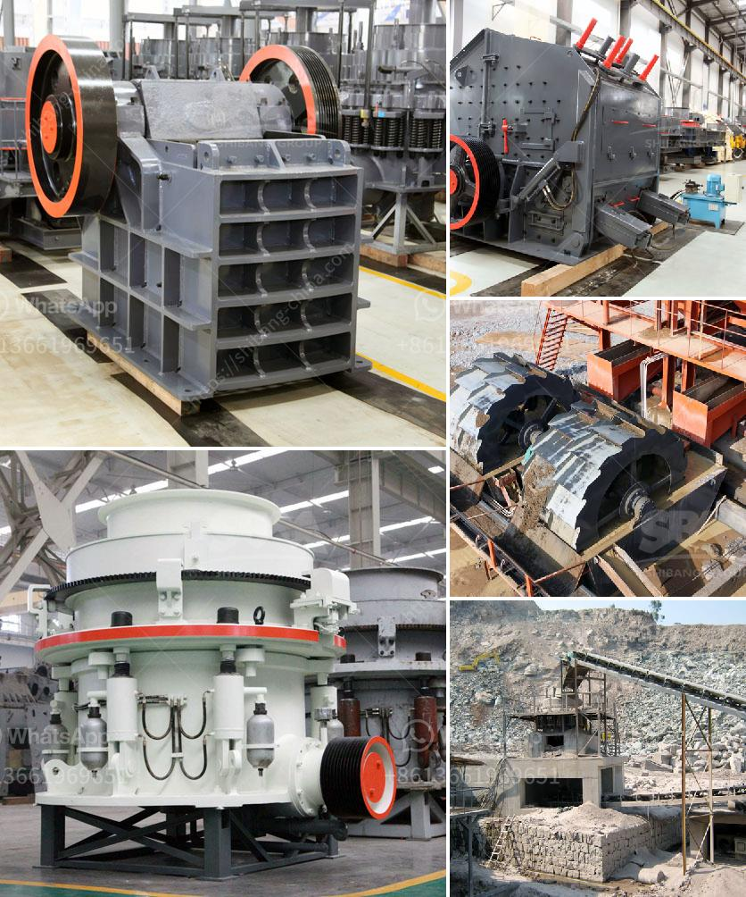

<h3>prices for sand washer on sale in india</h3>
As the demand for sand continues to rise in various construction and industrial applications, the importance of efficient sand washing systems is undeniable. Sand washers have become an essential tool to ensure the quality of sand, removing impurities, silt, and clay particles. In India, where construction and infrastructure projects are thriving, finding sand washers on sale at competitive prices is crucial for both individuals and businesses. This article aims to explore the range of prices for sand washers on sale in India.

The brand name and reputation of the sand washer manufacturer play a significant role in determining the price. Renowned brands that have established trust and reliability tend to offer their products at a slightly higher price. However, investing in a reputable brand ensures product durability and efficient performance.

The size and specifications of a sand washer directly impact its pricing. Sand washers with higher capacities, motor power, and advanced features are often priced higher due to their ability to handle larger quantities of sand. Additionally, advanced features such as adjustable water pressure, multiple wash cycles, and specialized settings also contribute to the overall cost.

The quality and durability of the materials used in the construction of the sand washer significantly impact the price. Models made of high-grade stainless steel, corrosion-resistant components, and sturdy frames tend to be priced higher than those made of less durable materials. Investing in a high-quality sand washer ensures longevity and reduced maintenance costs in the long run.

The availability of after-sales service and support can affect the pricing of sand washers. Brands that offer comprehensive customer support, warranty periods, and readily available spare parts may charge a slightly higher price. However, this ensures peace of mind for buyers who can rely on prompt assistance and maintenance services, if required.

In the Indian market, the price range for sand washers on sale typically varies between INR 20,000 to INR 50,000. However, it is essential to note that these prices are approximate and subject to fluctuations based on the factors mentioned earlier.

At the lower end of the spectrum, one can find budget-friendly sand washers suitable for small-scale projects or personal use. These washers typically provide basic functionality with standard capacity and fewer advanced features. However, they still offer adequate cleaning capabilities.

On the higher end of the price range, one can find premium sand washers with larger capacities, advanced technological features, and increased durability. These washers are often preferred by construction companies and industrial users who require robust and efficient systems to handle large volumes of sand.

Investing in a reliable sand washer is crucial to ensure the production of high-quality, clean sand for construction and industrial purposes. By comprehending the various factors influencing the pricing of sand washers in India, individuals and businesses can make informed choices while evaluating the available options. It is recommended to strike a balance between price and quality, considering the specific requirements and budgets in order to maximize the value of sand washers on sale.
<h3>Contact us</h3><ul><li><strong>Whatsapp:&nbsp;<a href="https://wa.me/8613661969651">+8613661969651</a></strong></li><li><a href="https://swt.shibang-china.com/?git&amp;zhl&amp;prices for sand washer on sale in india"><strong>Online Service(chat now)</strong></a></li></ul><h3>Related</h3><ul><li><a href='crushing and screening of manganese ore.md'>crushing and screening of manganese ore</a></li><li><a href='sell 150 tph stone crusher.md'>sell 150 tph stone crusher</a></li><li><a href='cost of a primairy crusher.md'>cost of a primairy crusher</a></li><li><a href='gypsum processing plant.md'>gypsum processing plant</a></li><li><a href='turkey project gypsum powder production line.md'>turkey project gypsum powder production line</a></li></ul>