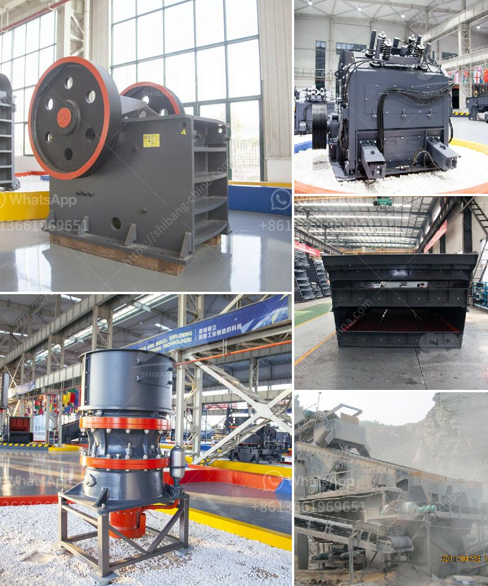

<h3>prices of conveyor belt</h3>
Conveyor belts have become an integral part of various industries over the years. These mechanized systems have revolutionized the way materials are transported within factories, warehouses, and other industrial settings. With their ability to move heavy loads efficiently and reliably, conveyor belts have enhanced productivity and streamlined operations across a wide range of sectors.

When it comes to purchasing a conveyor belt, one of the crucial factors to consider is the price. Conveyor belt prices can vary greatly depending on various factors such as the type of belt, material composition, length, width, operational requirements, and the supplier. In this article, we will explore the price range of conveyor belts and factors that need to be considered to make an informed decision.

The price range of conveyor belts can be quite extensive, starting from a few hundred dollars and reaching up to several thousand dollars. The cost of a conveyor belt primarily depends on its specifications, including:

1. Belt Type: The choice of belt type impacts the overall cost significantly. PVC belts are typically cheaper compared to other types such as rubber or modular plastic belts. The durability and operational requirements of the application should dictate the selection of belt material.

2. Size and Dimensions: The length and width of the conveyor belt will determine the price, as longer and wider belts require more raw material and manufacturing efforts. Additionally, custom-made belts designed to fit specific spaces or requirements may come with a higher price tag.

3. Load Capacity: Conveyor belts are designed to handle different load capacities. Heavy-duty belts capable of carrying higher loads generally cost more than those with lower load capacities. The load-bearing capacity requirement of the application must be carefully assessed to avoid over or under investment.

4. Operational Environment: Harsh environments, such as those with extreme temperatures, chemicals, or excessive moisture, may necessitate special belt materials and designs. These specialized belts are often more expensive than standard conveyor belts.

5. Supplier and Brand: The reputation and expertise of the supplier or manufacturer play a significant role in the pricing. Established and renowned suppliers may charge more for their products, but they often provide superior quality and service.

It is important to note that opting for the cheapest conveyor belt available may not always be the most cost-effective choice in the long run. Cheaper belts may have shorter lifespans, require more frequent maintenance, and be more prone to failures, resulting in increased operational downtime and costs. Investing in a higher-quality, more durable belt can lead to improved productivity and reduced maintenance and replacement expenses over time.

To make an informed decision about conveyor belt prices, it is recommended to consult with reputable suppliers, compare quotes, and consider the specific operational requirements of the application. Collaborating with experts in the field can help ensure that the chosen conveyor belt meets the desired criteria while offering the best value for money.

In conclusion, conveyor belts are essential machinery for numerous industries, and their prices can vary significantly depending on multiple factors. Understanding the specifications, requirements, and operational environment of the application is crucial to selecting the right conveyor belt at the most appropriate price point. By investing wisely in a durable and efficient conveyor belt, businesses can enhance productivity, improve operational safety, and optimize their overall profitability.
<h3>Contact us</h3><ul><li><strong>Whatsapp:&nbsp;<a href="https://wa.me/8613661969651">+8613661969651</a></strong></li><li><a href="https://swt.shibang-china.com/?git&amp;zhl&amp;prices of conveyor belt"><strong>Online Service(chat now)</strong></a></li></ul><h3>Related</h3><ul><li><a href='coal screening machine suppliers.md'>coal screening machine suppliers</a></li><li><a href='cone crusher manufacturer in south africa.md'>cone crusher manufacturer in south africa</a></li><li><a href='ball and pebble mills.md'>ball and pebble mills</a></li><li><a href='silica sand washing process.md'>silica sand washing process</a></li><li><a href='crushing construction waste crusher.md'>crushing construction waste crusher</a></li></ul>