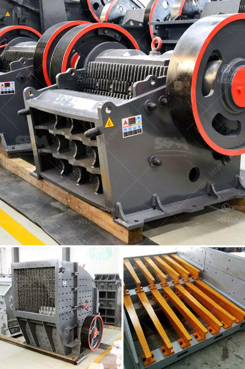

<h3>primary jaw crusher for limestone</h3>
With the rapid development of ore mining industry, the demand for crushing equipment is also growing. The primary jaw crusher is one of the most essential equipment in limestone mining process. It is mainly used as the primary crushing machine for stationary limestone production line.

This crusher has two heavy duty manganese steel jaws, which compress the limestone into small pieces. The powerful crushing capacity allows the jaw crusher to crush even the hardest materials. This jaw crusher is capable of crushing up to 350 tons per hour, depending on the feed size and material.

It is suitable for crushing medium-hard and hard materials, such as limestone and has the benefits of large crushing ratio, stable performance and high efficiency.

The primary jaw crusher is usually used for crushing limestone. It is characterized by large crushing ratio, high production capacity and uniform particle size. Hammer crusher, on the other hand, is suitable for crushing brittle materials, such as limestone, with compression strength less than 200MPa.

Due to the different principle of crushing these materials, the reduction ratio of jaw crusher, compared to hammer crusher, is higher.

In order to select the suitable primary crusher for your limestone crushing plant, you should consider the following factors:

1. Feed size: You should choose a jaw crusher capable of handling feed sizes that are larger than the largest limestone particles you expect to encounter. This will ensure that the crushed material can be fed to downstream equipment evenly and efficiently.

2. Capacity: The capacity of the jaw crusher is typically determined by the size of the feed opening. A larger feed opening allows for larger rocks to be processed and crushed. Therefore, if you are dealing with a large amount of limestone, you should choose a jaw crusher with a larger feed opening.

3. Product size: The size of the crushed product is an important consideration when choosing a primary crusher. You should select a jaw crusher that can produce the desired product size while minimizing fines production. This will help ensure the efficiency of downstream equipment, such as conveyor systems and screens.

4. Maintenance: The maintenance requirements of a primary crusher can vary greatly depending on the type of material being crushed. In the case of limestone, it is important to consider the long-term maintenance requirements when choosing a primary crusher. Jaw crushers have simple maintenance requirements and are easy to operate.

In conclusion, primary jaw crusher is extensively used in limestone crushing plants. For limestone with different particle sizes, the primary jaw crusher can be selected to crush the maximum materials into smaller particles. Through careful selection and design, a suitable primary crusher can help to ensure the efficiency and productivity of limestone mining process.
<h3>Contact us</h3><ul><li><strong>Whatsapp:&nbsp;<a href="https://wa.me/8613661969651">+8613661969651</a></strong></li><li><a href="https://swt.shibang-china.com/?git&amp;zhl&amp;primary jaw crusher for limestone"><strong>Online Service(chat now)</strong></a></li></ul><h3>Related</h3><ul><li><a href='tons per day ball mill.md'>tons per day ball mill</a></li><li><a href='sand and gravel exploration equipment.md'>sand and gravel exploration equipment</a></li><li><a href='sell 150 tph stone crusher.md'>sell 150 tph stone crusher</a></li><li><a href='stone crushers machinery in south africa.md'>stone crushers machinery in south africa</a></li><li><a href='mineral crusher processing plants china.md'>mineral crusher processing plants china</a></li></ul>