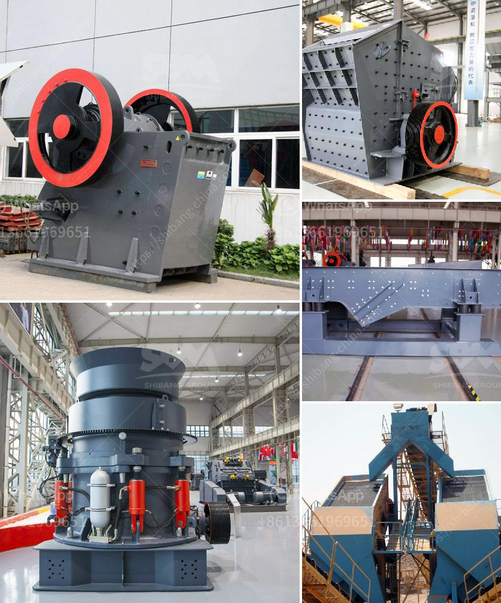

<h3>principle of roller mill</h3>
The principle of roller mill is based on crushing and grinding grains between two cylindrical rollers. They rotate in opposite directions and create shear forces through the gradual compression of the material. This results in the breakage of the grains into smaller particles, which are then sieved out through an adjustable gap between the rollers.

One of the key advantages of roller mills is their ability to produce a consistent and uniform grind size. This is crucial in industries such as flour milling and brewing, where the desired particle size directly affects the quality of the final product. The gap between the rollers can be adjusted to achieve the desired grind size, allowing for precise control over the final output.

Roller mills are also known for their versatility and efficiency. They can process a wide range of materials, including grains, seeds, and even certain types of plastics. This flexibility makes them suitable for various industries, from food processing to pharmaceutical manufacturing.

In addition to their grinding capabilities, roller mills can also provide other important functions, such as blending and homogenizing. By adjusting the speed and direction of the rollers, it is possible to mix different components together and ensure a consistent composition.

When it comes to maintenance, roller mills are relatively easy to maintain. The rollers can be easily cleaned and replaced if necessary, and the overall design of the machine minimizes the risk of product contamination.

In conclusion, the principle of roller mill offers a powerful and efficient method for grinding and processing materials. Its ability to produce a consistent grind size, versatility, and ease of maintenance make it a popular choice in various industries. Whether you need to process grains, seeds, or other materials, a roller mill can deliver reliable results.
<h3>Contact us</h3><ul><li><strong>Whatsapp:&nbsp;<a href="https://wa.me/8613661969651">+8613661969651</a></strong></li><li><a href="https://swt.shibang-china.com/?git&amp;zhl&amp;principle of roller mill"><strong>Online Service(chat now)</strong></a></li></ul><h3>Related</h3><ul><li><a href='total power for jaw crusher 500 tph.md'>total power for jaw crusher 500 tph</a></li><li><a href='cone crusher manufacturer in south africa.md'>cone crusher manufacturer in south africa</a></li><li><a href='sale limestone crusher malaysia.md'>sale limestone crusher malaysia</a></li><li><a href='equipment required for producing lime for new plant.md'>equipment required for producing lime for new plant</a></li><li><a href='sample of joint operations agreement quarry mining.md'>sample of joint operations agreement quarry mining</a></li></ul>