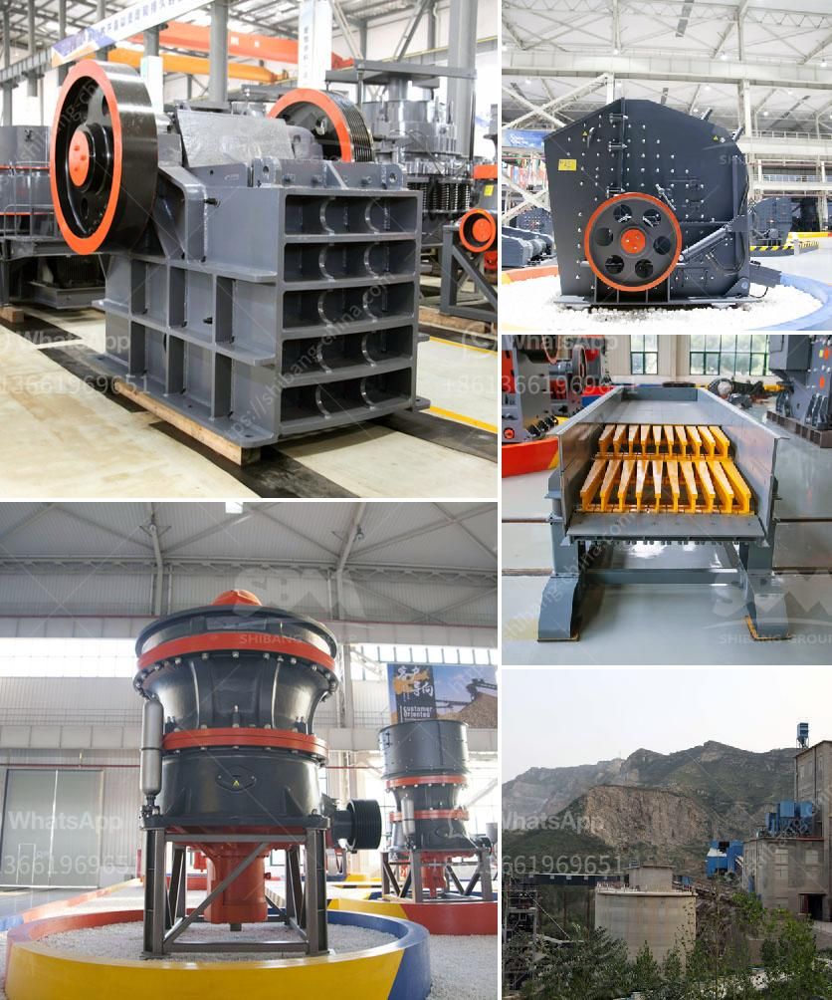

<h3>process of limestone mining to market</h3>
Limestone is a sedimentary rock composed mostly of calcium carbonate (CaCO3) that is found in abundance around the world. Its uses vary, but it is most commonly used in the construction industry as a building material and in the manufacturing of cement, glass, and lime. As limestone deposits are found in different parts of the world, the mining process varies.

The mining process involves the extraction of valuable minerals or other geological materials from the earth using various techniques. These techniques may include underground mining, open-pit mining, and quarrying, among other methods. Limestone mining can help to create jobs and spur economic growth.

However, the process of mining limestone involves certain challenges like finding and then extracting suitable limestone reserves and understanding the geological constraints of the location. Once the quarry is open or underground mine is setup, drilling and blasting may be required to break down the hard rock into manageable pieces.

Explosives are commonly used in this process to break large chunks of limestone into smaller, more manageable sizes. The broken limestone pieces are then transported to a crusher or impactor where they are further reduced in size. After crushing, the limestone is screened and classified according to its size.

The limestone products are then stored or transported to the final market, depending on the intended use. In the case of construction materials, the limestone may be transported to a cement plant to be mixed with other materials before being heated in a kiln. The heated mixture is then ground to create cement, which is used in the production of concrete.

Mining limestone provides employment opportunities for local communities and stimulates economic growth in the surrounding areas. However, it is crucial to ensure that the mining process is environmentally sustainable. Mining companies must adhere to strict guidelines to minimize their impact on the environment. This may include reclamation and rehabilitation efforts to restore the land after mining activities are completed.

In conclusion, the mining and marketing of limestone involve various processes that are essential for its utilization in multiple industries. From exploration and extraction to crushing and transportation, each step plays a significant role in bringing limestone from the ground to the market. It is crucial to conduct mining activities with proper environmental stewardship to ensure the sustainability of these valuable resources.
<h3>Contact us</h3><ul><li><strong>Whatsapp:&nbsp;<a href="https://wa.me/8613661969651">+8613661969651</a></strong></li><li><a href="https://swt.shibang-china.com/?git&amp;zhl&amp;process of limestone mining to market"><strong>Online Service(chat now)</strong></a></li></ul><h3>Related</h3><ul><li><a href='grinding ball mill.md'>grinding ball mill</a></li><li><a href='china clay manufacturing process.md'>china clay manufacturing process</a></li><li><a href='capacity stone crusher.md'>capacity stone crusher</a></li><li><a href='iron ore mining crushing process.md'>iron ore mining crushing process</a></li><li><a href='pioneer ft impact crusher.md'>pioneer ft impact crusher</a></li></ul>