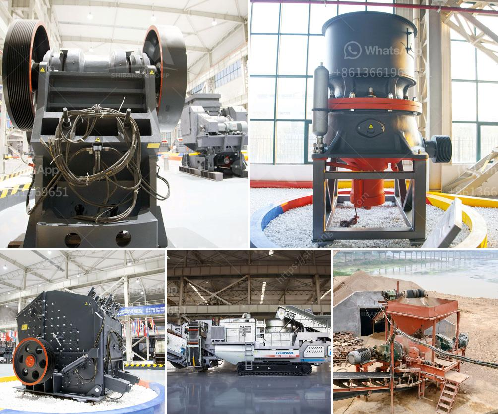

<h3>process of making silica sand</h3>
Silica sand, also known as quartz sand, is a naturally occurring granular material composed of quartz and other minerals. It is highly abundant and found in many parts of the world, making it one of the most widely used materials in various industries.

The process of making silica sand begins with extracting raw materials from quarries or mines. The obtained raw materials are then transported to the processing plant, where they are washed, sorted, and dried.

The first step in the process is washing. Silica sand often contains impurities such as clay, iron oxides, and organic matter, which need to be removed to produce high-quality sand. Washing is done using water and various chemicals to break up and remove these impurities. The sand is mixed vigorously with water, and the impurities settle at the bottom, while the purified sand floats on the surface. This process is repeated several times until the desired level of purity is achieved.

Once the sand is washed, it is subjected to further processing. Sorting is an important step, where the washed sand is separated into different particle sizes. This is done using screens or sieves that have different mesh sizes. The sand is passed through these screens, and each size fraction is collected separately. This step ensures that the final product has a uniform particle size distribution, which is desirable for many applications.

After sorting, the sand is ready to be dried. Drying is crucial to remove any remaining moisture from the sand, as moisture can cause the sand to clump together and impact its performance. There are various methods of drying, including rotary dryers, fluidized bed dryers, and even sunlight drying. The choice of drying method depends on factors such as the desired moisture content, production capacity, energy efficiency, and cost.

Once dried, the silica sand is often subjected to additional treatments to further enhance its purity and quality. These treatments may include magnetic separation, froth flotation, or acid leaching, depending on the specific requirements of the industry that will use the sand. For example, in the glass industry, the sand may undergo an acid leaching process to remove impurities and improve its transparency.

Finally, the processed silica sand is stored and packaged for distribution. It can be stored in silos or bags, ready to be shipped to customers. The packaging is designed to protect the sand from moisture and contamination during transportation.

In conclusion, the process of making silica sand involves several steps, including washing, sorting, drying, and sometimes additional treatments. These steps ensure that the final product is of high purity and suitable for various applications. Silica sand is an essential material in industries such as glass manufacturing, construction, foundry, and many others, making its production process crucial to meet the global demand for this versatile material.
<h3>Contact us</h3><ul><li><strong>Whatsapp:&nbsp;<a href="https://wa.me/8613661969651">+8613661969651</a></strong></li><li><a href="https://swt.shibang-china.com/?git&amp;zhl&amp;process of making silica sand"><strong>Online Service(chat now)</strong></a></li></ul><h3>Related</h3><ul><li><a href='manufacturing company for ball mill.md'>manufacturing company for ball mill</a></li><li><a href='how to use hammer mill.md'>how to use hammer mill</a></li><li><a href='stone crusher kenya.md'>stone crusher kenya</a></li><li><a href='project report on m sand.md'>project report on m sand</a></li><li><a href='grinding machine for salt in pakistan.md'>grinding machine for salt in pakistan</a></li></ul>