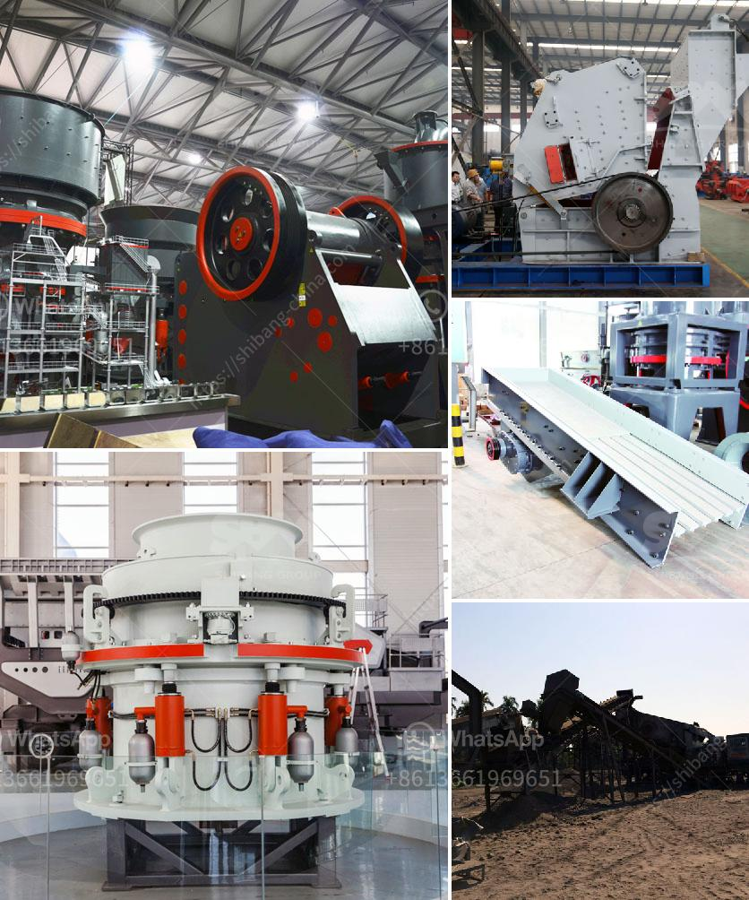

<h3>process of manufacturing clay products</h3>
The process of manufacturing clay products involves various steps that transform raw clay into functional and aesthetically appealing objects. Clay has been used for centuries to create pottery, bricks, tiles, and other essential items. Understanding the manufacturing process helps one appreciate the skill and effort that goes into crafting these clay products.

The initial step in the manufacturing process is clay extraction. Clay is typically found in deposits near riverbanks or in areas with a high concentration of minerals. The clay is then excavated using heavy machinery and transported to the manufacturing facility.

Once the clay arrives at the facility, it undergoes a purification process to remove impurities such as rocks, twigs, and other organic matter. This step ensures that the final clay product is of high quality and consistency.

After purification, the clay is prepared for shaping. It is mixed with water and other additives to achieve the desired consistency and plasticity. This stage is crucial as it determines how well the clay can be molded and shaped during the next steps.

The next step involves the shaping of the clay. This can be done manually or by employing machines such as potter's wheels or extruders. Manual shaping requires skilled craftsmen who use their hands and various tools to shape the clay into the desired form. Alternatively, machines can be used to shape the clay quickly and with precision.

Once the clay has been shaped, it is left to dry. This allows the moisture content in the clay to evaporate, making it hard and durable. The drying process can take several days or even weeks, depending on the size and thickness of the clay object. It is essential to dry the clay slowly to prevent cracking or warping.

After the clay has dried, it is ready for the first firing, also known as the bisque firing. The clay objects are placed in a kiln and heated at high temperatures. This firing process removes any remaining moisture in the clay and strengthens it further. The temperature and duration of the firing depend on the type of clay and the desired final product.

Once the bisque firing is complete, the clay objects are examined for any imperfections such as cracks or deformities. These can be fixed by adding additional clay or sanding down rough edges. The objects are then glazed, which involves applying a coat of liquid glass to enhance their appearance and add a protective layer.

After the glazing, the clay products undergo a final firing known as the glaze firing. This firing brings the glaze to its final form, imparting color, sheen, and durability to the clay objects. The temperature and duration of this firing are carefully controlled to achieve the desired finish.

Once the glaze firing is complete, the clay products are inspected for quality assurance. Any defective or substandard items are discarded, ensuring that only the best products reach the market. The clay products are then packaged and prepared for distribution.

The process of manufacturing clay products combines traditional craftsmanship with modern technology. Skilled artisans, along with automated machinery, work together to create functional and visually appealing objects. The artistry and precision required in each step highlight the beauty and value of clay products, making them cherished and sought-after items.
<h3>Contact us</h3><ul><li><strong>Whatsapp:&nbsp;<a href="https://wa.me/8613661969651">+8613661969651</a></strong></li><li><a href="https://swt.shibang-china.com/?git&amp;zhl&amp;process of manufacturing clay products"><strong>Online Service(chat now)</strong></a></li></ul><h3>Related</h3><ul><li><a href='mobile screening machine south africa.md'>mobile screening machine south africa</a></li><li><a href='price for stone crusher plant.md'>price for stone crusher plant</a></li><li><a href='marble grinder mill machine.md'>marble grinder mill machine</a></li><li><a href='crushing equipment south africa crusher quotes.md'>crushing equipment south africa crusher quotes</a></li><li><a href='jaw crusher design handbook.md'>jaw crusher design handbook</a></li></ul>