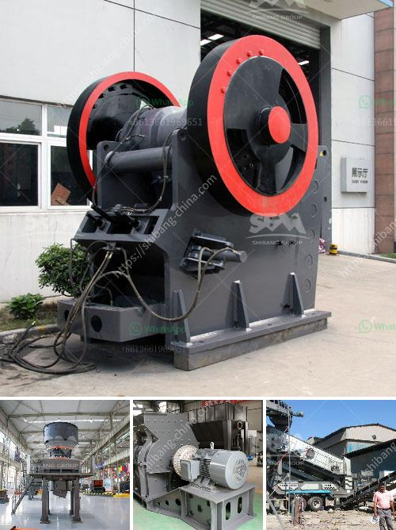

<h3>processing of bauxite crusher</h3>
Bauxite is a mineral that is commonly used in the production of aluminum. It is extracted from the soil and processed in different ways, depending on its intended use. One of the most common methods of processing bauxite is through the use of a crusher. This machine is designed to break down the large chunks of bauxite into smaller and more manageable pieces.

The processing of bauxite using a crusher is crucial for the overall efficiency and effectiveness of the entire manufacturing process. Crushers are used to reduce the size of the bauxite ore, making it easier to transport and process through the refineries. The crushing process ensures that the bauxite is suitable for the production of aluminum, as well as other downstream products such as cement, stainless steel, and even some cosmetics.

In the crusher, bauxite ore is fed into a rotating drum filled with iron balls. As the drum rotates, the balls cascade and crush the ore into smaller fragments. The resulting material is then screened through vibrating screens to separate the crushed ore into different sizes. The smaller, more finely crushed pieces are sent to the refineries for further processing, while the larger pieces are recycled back into the crusher for re-crushing.

The use of crushers in the processing of bauxite offers several advantages. Firstly, it reduces the size of the ore, making it easier to handle and transport. This, in turn, leads to lower transportation costs and improves the overall efficiency of the extraction process. Secondly, by breaking down the bauxite into smaller fragments, the crusher helps to increase the surface area, which promotes better chemical reactions during the refining phase.

In conclusion, the processing of bauxite using a crusher plays a crucial role in ensuring the efficient and effective production of aluminum and other downstream products. By reducing the size of the bauxite ore, the crusher facilitates easier transportation and refining processes. Additionally, it increases the surface area of the ore, improving the overall efficiency of the refining phase. As the demand for aluminum continues to rise, the processing of bauxite with crushers will remain an integral part of the manufacturing process.
<h3>Contact us</h3><ul><li><strong>Whatsapp:&nbsp;<a href="https://wa.me/8613661969651">+8613661969651</a></strong></li><li><a href="https://swt.shibang-china.com/?git&amp;zhl&amp;processing of bauxite crusher"><strong>Online Service(chat now)</strong></a></li></ul><h3>Related</h3><ul><li><a href='grinding ball mill philippines.md'>grinding ball mill philippines</a></li><li><a href='mica powder making.md'>mica powder making</a></li><li><a href='small coal mining machine.md'>small coal mining machine</a></li><li><a href='cebu supplier of disposable jaw crusher.md'>cebu supplier of disposable jaw crusher</a></li><li><a href='wet and dry ball mill.md'>wet and dry ball mill</a></li></ul>