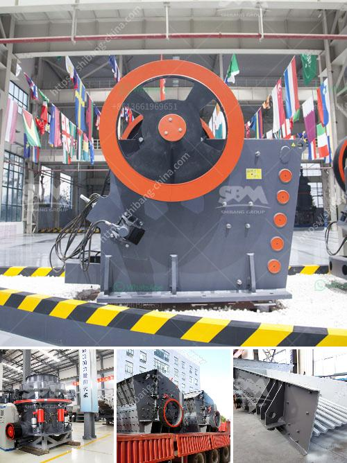

<h3>processing of calcium carbonate</h3>
Calcium carbonate is a common compound found in rocks, shells, and even pearls. It is widely used in various industries due to its versatile properties. The processing of calcium carbonate involves several stages that are designed to extract its purest form.

The first step in processing calcium carbonate is quarrying, where the raw material is extracted from the earth using heavy machinery. After quarrying, the calcium carbonate rock is crushed to smaller sizes using crushers. The crushed calcium carbonate is then ground into a fine powder, which is classified by a separator.

Next, the powder undergoes a process called wet milling, where it is mixed with water to form a slurry. This slurry is then reacted with acid, usually hydrochloric acid, to remove impurities. The acid reacts with the calcium carbonate, forming soluble calcium chloride and releasing carbon dioxide gas.

The slurry is then filtered to separate the solid calcium chloride from the liquid. After filtration, the calcium chloride precipitate is washed and dried to remove any remaining water. This precipitate can be further processed to obtain different forms of calcium carbonate, such as precipitated calcium carbonate (PCC) or ground calcium carbonate (GCC), which have slightly different properties and uses.

PCC is produced by carbonation of limestone, which involves reacting calcium hydroxide with carbon dioxide gas. This process produces a fine, white powder that is used in various industrial applications, such as paper, plastics, paints, and coatings.

GCC, on the other hand, is produced by grinding and classifying natural calcium carbonate rocks. This form of calcium carbonate is widely used in the construction industry as a filler or additive in cement, concrete, and other building materials.

In conclusion, the processing of calcium carbonate involves quarrying, crushing, grinding, and various chemical reactions to obtain pure calcium carbonate. The resulting product is used in a wide range of industries due to its versatile properties. Whether it's in the form of PCC or GCC, calcium carbonate plays a crucial role in many everyday products and applications.
<h3>Contact us</h3><ul><li><strong>Whatsapp:&nbsp;<a href="https://wa.me/8613661969651">+8613661969651</a></strong></li><li><a href="https://swt.shibang-china.com/?git&amp;zhl&amp;processing of calcium carbonate"><strong>Online Service(chat now)</strong></a></li></ul><h3>Related</h3><ul><li><a href='jaw crusher machine supplier.md'>jaw crusher machine supplier</a></li><li><a href='slag grinding mill.md'>slag grinding mill</a></li><li><a href='crusher machine for sale kenya.md'>crusher machine for sale kenya</a></li><li><a href='hammer mill capacity 80 ton per hour.md'>hammer mill capacity 80 ton per hour</a></li><li><a href='jaw crusher machinery.md'>jaw crusher machinery</a></li></ul>