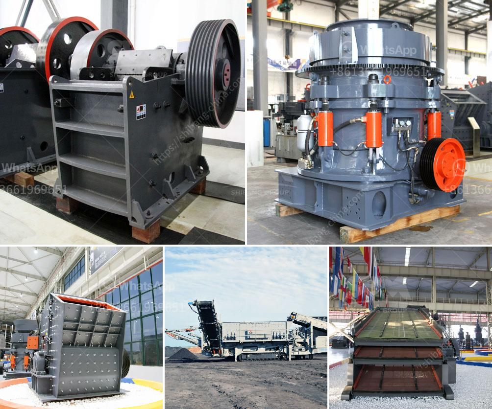

<h3>production line for calcium carbonate</h3>
The production line for calcium carbonate is composed of various equipment to process different calcium carbonate powders. Calcium carbonate is widely used in many industrial applications, including plastics, rubber, paint, construction materials, and papermaking.

The first step in the production line is crushing of calcium carbonate. This process utilizes a jaw crusher or impact crusher to break down the calcium carbonate into smaller particles. The particles are then conveyed to a vibrating screen where different-sized particles are separated.

Next, the calcium carbonate particles are sent to a grinding mill. The grinding mill efficiently grinds the particles into a fine powder, ensuring the desired particle size distribution is achieved. The most common types of grinding mills used in calcium carbonate production include ball mills, Raymond mills, and vertical roller mills.

Once the calcium carbonate powder is obtained, it undergoes further processing to enhance its quality and properties. One common method is surface modification, which involves coating the powder particles with a surface modifier. This process enhances the dispersibility and stability of the calcium carbonate powder, making it easier to incorporate into various applications.

Another important step in the production line is particle size classification. Through a process called air classification, the calcium carbonate powder is separated into different particle size fractions. This allows industries to obtain calcium carbonate powders with the desired particle size range for specific applications.

The final step in the production line is packaging and storage. The calcium carbonate powder is typically packaged in bags, bulk containers, or even shipped in bulk for large-scale applications. Proper packaging ensures the powder's quality is maintained during transportation and storage, minimizing the risk of contamination or degradation.

In recent years, there have been advancements in calcium carbonate production line technology. For example, some production lines now incorporate advanced automation systems to monitor and control the entire production process, ensuring consistent quality and efficiency. Additionally, there is a growing trend towards using renewable energy sources, such as solar or wind power, to reduce the environmental impact of the production line.

The production line for calcium carbonate plays a crucial role in meeting the ever-increasing demand for this versatile mineral. As industries continue to innovate and develop new applications for calcium carbonate, the production line must adapt to produce high-quality powders with specific properties. By continually improving and advancing the production process, calcium carbonate manufacturers can meet the diverse needs of various industries while minimizing environmental impact.
<h3>Contact us</h3><ul><li><strong>Whatsapp:&nbsp;<a href="https://wa.me/8613661969651">+8613661969651</a></strong></li><li><a href="https://swt.shibang-china.com/?git&amp;zhl&amp;production line for calcium carbonate"><strong>Online Service(chat now)</strong></a></li></ul><h3>Related</h3><ul><li><a href='powdered limestone making places.md'>powdered limestone making places</a></li><li><a href='high pressure roller mill.md'>high pressure roller mill</a></li><li><a href='coal crushing and washing plant for sale south africa.md'>coal crushing and washing plant for sale south africa</a></li><li><a href='jual jaw crusher 400 x.md'>jual jaw crusher 400 x</a></li><li><a href='jual mesin hammer mill crusher for sale.md'>jual mesin hammer mill crusher for sale</a></li></ul>