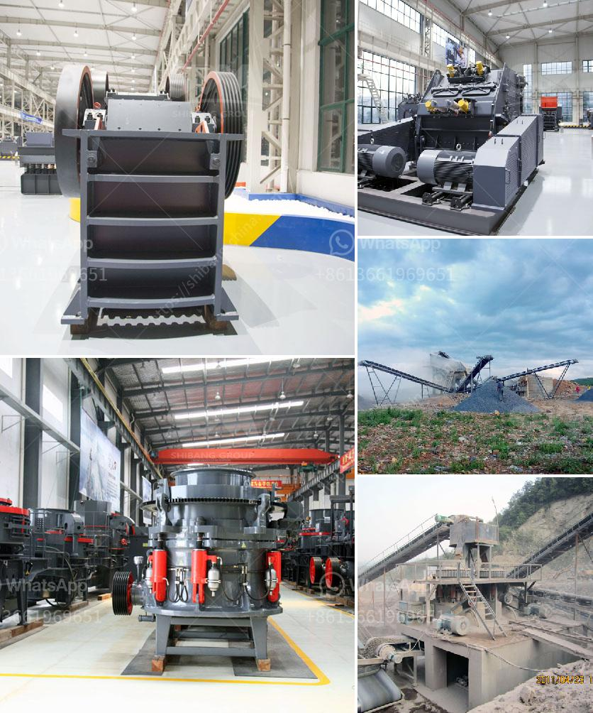

<h3>production of stone crusher</h3>
The stone crusher is a piece of indispensable equipment for the stone crushing line, Which can be used for primary, secondary and fine crushing of more than 200 kinds of rough stones such as granite, basalt, limestone, rock, concrete, aggregate, gravel, dolomite and quartz.

Stone crushing is a crucial and primary stage in the stone processing industry, and the production efficiency greatly relies on the power of the stone crusher. The machine employs the principle of squeezing, which squeezes the material between two jaws. It can provide high-quality sand and gravel aggregate for mining and construction industries, with a wide range of applications.

Firstly, the stone crusher is designed with a deep v-shaped crushing chamber and an optimized nip angle, which enables the large stones to be quickly crushed. Secondly, the machine has a large crushing ratio, which reduces the consumption of the single machine and improves the crushing efficiency. Thirdly, the stone crusher is equipped with a hydraulic control system, which can quickly adjust the discharge port size and remove non-crushing objects.

Moreover, the stone crusher adopts standardized production technology to reduce the failure rate and increase the overall productivity. The high-quality materials and advanced manufacturing technology are adopted to ensure the long service life of the stone crusher. Additionally, a green environmental protection feature is incorporated into the design of the stone crusher, which enables it to control the dust and noise pollution during the operation.

In conclusion, the stone crusher with the advantages of high productivity, low energy consumption, wear resistance, compact size, and easy operation, has been the choice of many processing companies, both domestically and internationally. Its wide range of applications in various industries, such as mining, construction, and metallurgy, has further highlighted its significance in the stone production line.
<h3>Contact us</h3><ul><li><strong>Whatsapp:&nbsp;<a href="https://wa.me/8613661969651">+8613661969651</a></strong></li><li><a href="https://swt.shibang-china.com/?git&amp;zhl&amp;production of stone crusher"><strong>Online Service(chat now)</strong></a></li></ul><h3>Related</h3><ul><li><a href='graphite production machinery.md'>graphite production machinery</a></li><li><a href='drywall grinding for gypsum.md'>drywall grinding for gypsum</a></li><li><a href='used stone crusher for sale in india.md'>used stone crusher for sale in india</a></li><li><a href='mobile crushing machine sales in south africa.md'>mobile crushing machine sales in south africa</a></li><li><a href='total power for jaw crusher 500 tph.md'>total power for jaw crusher 500 tph</a></li></ul>