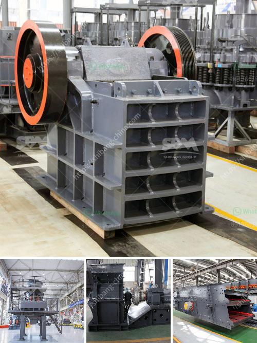

<h3>production process of calcium carbonate</h3>
Calcium carbonate is a compound that plays a crucial role in a plethora of industries, ranging from construction to healthcare. This versatile compound is widely used as a filler and a coating material in the manufacturing of various products. Understanding the production process of calcium carbonate helps to comprehend why it is in high demand and how it is produced efficiently.

The production process of calcium carbonate begins with the extraction of limestone, a sedimentary rock found in large deposits. These limestone deposits are commonly found in areas with significant geological activity, such as ancient marine environments. The extraction process involves drilling, blasting, and crushing the limestone into smaller pieces.

Once the limestone is extracted and crushed, it undergoes further purification to remove impurities. This purification process typically involves washing the limestone with a solution of water and/or a weak acid, depending on the impurities present. This step helps in enhancing the quality and purity of the final calcium carbonate product.

After purification, the limestone is then subjected to a high-temperature calcination process in a kiln. During this process, the limestone is heated to a temperature of around 900-1000 degrees Celsius, causing it to undergo a chemical reaction known as thermal decomposition. This reaction results in the formation of calcium oxide (quicklime) and carbon dioxide gas.

The quicklime obtained from the calcination process is then slaked by adding water, leading to the formation of calcium hydroxide. This calcium hydroxide solution is then subjected to a precipitation process, where carbon dioxide gas is passed through it. This causes calcium carbonate to precipitate out of the solution in the form of a fine powder.

The calcium carbonate powder obtained is then purified through a series of processes, including filtration, drying, and milling, to meet the required specifications for different applications. These processes help in producing calcium carbonate with specific particle sizes and purity levels, making it suitable for diverse industries such as paper, plastic, paint, and pharmaceuticals.

In conclusion, the production process of calcium carbonate involves the extraction and purification of limestone, followed by calcination, slaking, and precipitation processes. This ensures the production of high-quality calcium carbonate with precise specifications, meeting the demands of various industries. The versatility and usefulness of calcium carbonate make it an indispensable compound in modern manufacturing processes.
<h3>Contact us</h3><ul><li><strong>Whatsapp:&nbsp;<a href="https://wa.me/8613661969651">+8613661969651</a></strong></li><li><a href="https://swt.shibang-china.com/?git&amp;zhl&amp;production process of calcium carbonate"><strong>Online Service(chat now)</strong></a></li></ul><h3>Related</h3><ul><li><a href='ball mills layout.md'>ball mills layout</a></li><li><a href='gravel washing plant for sale in uk.md'>gravel washing plant for sale in uk</a></li><li><a href='industrial cone crusher.md'>industrial cone crusher</a></li><li><a href='manufacturing of conveyor belts in the vaal region.md'>manufacturing of conveyor belts in the vaal region</a></li><li><a href='dolomite crushing production line equipment.md'>dolomite crushing production line equipment</a></li></ul>