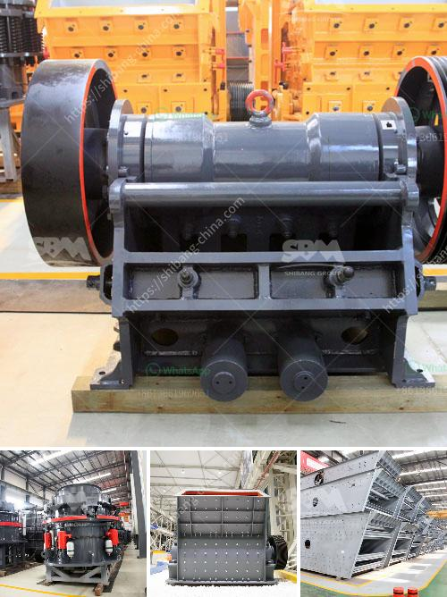

<h3>products hpc cone crusher</h3>
In the mining industry, crushing is an important process that helps in extracting valuable minerals from the ore. Mining operations require a significant amount of energy and resources to ensure the seamless operation of crushers. To meet these demands, manufacturers have introduced advanced technologies into the market to enhance crushing efficiency and reduce energy consumption. One such innovation is the HPC Cone Crusher.

The HPC Cone Crusher, also known as the hydraulic cone crusher, is a high-performance crusher designed for crushing various minerals and rocks. Its unique hydraulic system ensures that the crusher can effectively process hard and abrasive materials. With a minimum of maintenance, the HPC Cone Crusher offers maximum productivity.

One of the key features of the HPC Cone Crusher is its ability to adjust the crushing chamber setting. This adjustment allows users to easily fine-tune the crusher to meet specific product requirements. Whether it is a fine or coarse crushing operation, the HPC Cone Crusher can deliver the desired output without compromising on quality. This makes it an ideal choice for a wide range of applications, including limestone, granite, and iron ore.

The HPC Cone Crusher is equipped with a sturdy and reliable hydraulic system. This system allows the crusher to withstand the pressure and impact of heavy-duty operations. It also ensures smooth and trouble-free operation, even in the harshest conditions. Additionally, the hydraulic system provides quick and easy access to the internal components, making maintenance a hassle-free process.

In terms of energy efficiency, the HPC Cone Crusher stands out from the competition. Its efficient hydraulic system requires less energy to operate, resulting in reduced energy consumption and lower operating costs. This makes the crusher an economical choice for mining companies seeking to optimize their production and minimize expenses.

The HPC Cone Crusher also excels in safety features. Its robust design and advanced technology ensure that operators can safely operate the crusher without the risk of accidents. Additionally, the crusher is equipped with an automatic tramp release system that protects the crusher from non-crushable materials, preventing damage to the machine. This feature provides peace of mind to operators, knowing that the crusher is well-protected.

In conclusion, the HPC Cone Crusher is a remarkable product that offers numerous benefits to the mining industry. Its advanced technology, efficient hydraulic system, and robust design make it a reliable and cost-effective solution for crushing operations. With its ability to process hard and abrasive materials, adjust to desired settings, and deliver high-quality output, the HPC Cone Crusher is a must-have for mining companies aiming to maximize productivity and minimize costs.
<h3>Contact us</h3><ul><li><strong>Whatsapp:&nbsp;<a href="https://wa.me/8613661969651">+8613661969651</a></strong></li><li><a href="https://swt.shibang-china.com/?git&amp;zhl&amp;products hpc cone crusher"><strong>Online Service(chat now)</strong></a></li></ul><h3>Related</h3><ul><li><a href='grinding mill machine in zimbabwe.md'>grinding mill machine in zimbabwe</a></li><li><a href='rock crusher 500 cubic metre per day.md'>rock crusher 500 cubic metre per day</a></li><li><a href='sand making machine.md'>sand making machine</a></li><li><a href='feldspar milling market.md'>feldspar milling market</a></li><li><a href='wet and dry ball mill.md'>wet and dry ball mill</a></li></ul>