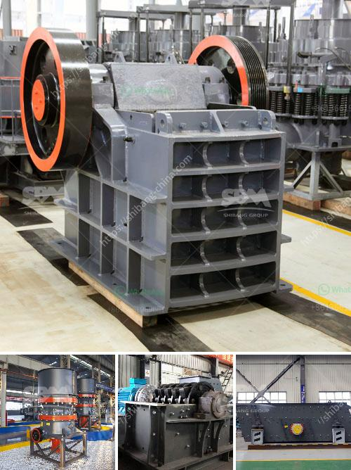

<h3>program to simulate conveyor belts</h3>
In today's world, automation has become an essential part of many industries. One area where automation has proven to be highly effective is the simulation of conveyor belts. Conveyor belts are mechanical systems that transport goods or materials from one point to another, often within a manufacturing or production facility. Simulating these conveyor belts can bring numerous benefits, including increased efficiency, reduced costs, and improved overall productivity.

A program that simulates conveyor belts provides a virtual environment in which the entire system can be tested and optimized. This program allows engineers and operators to experiment with different configurations, speeds, and loads, without the need to disrupt the actual production line. By simulating the conveyor belts, potential issues or bottlenecks can be identified and resolved in a controlled environment, preventing any disruption or downtime in the actual production process.

One of the primary advantages of using a conveyor belt simulation program is the ability to analyze and optimize the system's efficiency. By tweaking variables such as conveyor speed, material load, and distance, operators can find the most efficient combination that maximizes throughput while minimizing energy consumption. This optimization process can lead to substantial cost savings by identifying areas of improvement and reducing waste.

Furthermore, the simulation program can help in identifying potential bottlenecks or issues in the system. By running a virtual simulation, operators can observe the flow of materials and identify any areas where congestion occurs or where the system may be overwhelmed. With this knowledge, adjustments can be made to the conveyor belts or the overall layout to ensure smooth operations and prevent any potential production delays.

Another benefit of using a conveyor belt simulation program is the ability to train and educate operators in a safe and controlled environment. New employees or operators can be familiarized with the conveyor system's intricacies, operations, and potential troubleshooting techniques without the risk of accidents or damaging equipment. This training reduces the learning curve and ensures that new operators are equipped with the necessary skills and knowledge to operate the conveyor belts effectively.

In conclusion, a program that simulates conveyor belts brings numerous advantages to industries reliant on transportation and production. By optimizing efficiency, identifying and resolving bottlenecks, and providing realistic training scenarios, the simulation program contributes to increased productivity, reduced costs, and smoother operations. As automation continues to evolve, it is clear that conveyor belt simulations are a valuable tool for industries looking to remain competitive and efficient in today's fast-paced and demanding market.
<h3>Contact us</h3><ul><li><strong>Whatsapp:&nbsp;<a href="https://wa.me/8613661969651">+8613661969651</a></strong></li><li><a href="https://swt.shibang-china.com/?git&amp;zhl&amp;program to simulate conveyor belts"><strong>Online Service(chat now)</strong></a></li></ul><h3>Related</h3><ul><li><a href='pulverizers bauxite.md'>pulverizers bauxite</a></li><li><a href='coal pulveriser manufacturer.md'>coal pulveriser manufacturer</a></li><li><a href='difeerence between jow crusher and hammer mill.md'>difeerence between jow crusher and hammer mill</a></li><li><a href='marine diamond mining equipment.md'>marine diamond mining equipment</a></li><li><a href='design of screening machines.md'>design of screening machines</a></li></ul>