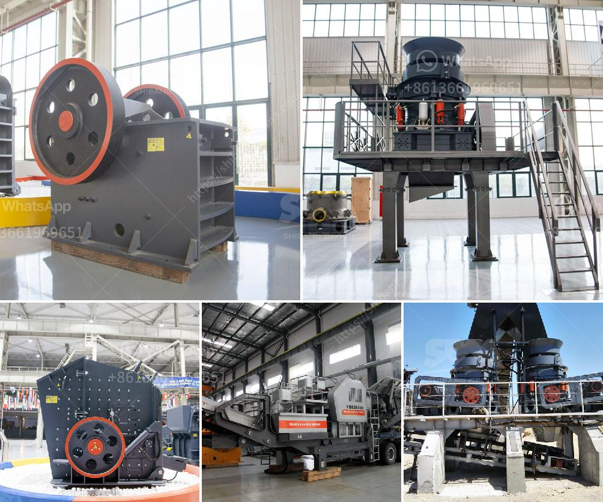

<h3>project cost of clinker grinding unit</h3>
The cement industry has constantly been expanding and diversifying over the years, creating immense opportunities for businesses in this sector. One such opportunity is the setting up of a clinker grinding unit, particularly for regions where the availability of raw materials is limited.

A clinker grinding unit refers to the plant used for grinding clinker, a material necessary for Portland cement production. Clinker is a blend of limestone, clay, and other minerals that are fused together in a kiln. The final product, called clinker, is then ground with a small quantity of gypsum into a powder to make cement.

When considering the cost of setting up a clinker grinding unit, there are several factors to consider. First and foremost is the availability and cost of raw materials in the region. The primary raw material for clinker production is limestone, which must be sourced locally or transported at a significant cost. The availability and cost of limestone, along with other minor raw materials, will impact the overall project cost.

Next, the size and capacity of the clinker grinding unit must be determined. This will depend on the expected demand for cement in the region and the scale of operation the business intends to achieve. Generally, larger grinding units are more cost-effective as they can achieve economies of scale and have a lower per-ton production cost. However, smaller grinding units may be suitable for regions with limited demand.

The selection of machinery and equipment for the clinker grinding unit is another crucial aspect. The quality and efficiency of the machinery will impact the overall cost of the project. It is advisable to invest in modern and energy-efficient equipment to reduce operational costs and increase productivity. Additionally, the maintenance and repair costs associated with the machinery should be taken into account.

Apart from machinery, other expenses involved in the project include land acquisition, construction, and infrastructure costs. Setting up a clinker grinding unit requires adequate space for the plant, storage, and other auxiliary facilities. The cost of land and construction may vary depending on the location and local regulations. Similarly, infrastructure costs like electricity, water supply, and transportation infrastructure need to be considered.

Lastly, labor costs should also be factored into the overall project cost. A clinker grinding unit requires a skilled workforce to operate and maintain the plant. The cost of labor will depend on the prevailing wage rates in the region. Adequate training programs and employee welfare schemes should also be part of the project cost.

In conclusion, the cost of setting up a clinker grinding unit depends on various factors such as raw material availability, size and capacity of the grinding unit, machinery and equipment selection, land acquisition, construction and infrastructure costs, and labor costs. Careful planning and analysis are essential to estimate the project cost accurately. A well-executed project can result in a profitable clinker grinding unit, contributing to the growth of the cement industry in the region.
<h3>Contact us</h3><ul><li><strong>Whatsapp:&nbsp;<a href="https://wa.me/8613661969651">+8613661969651</a></strong></li><li><a href="https://swt.shibang-china.com/?git&amp;zhl&amp;project cost of clinker grinding unit"><strong>Online Service(chat now)</strong></a></li></ul><h3>Related</h3><ul><li><a href='gypsum board manufacturing machine price.md'>gypsum board manufacturing machine price</a></li><li><a href='used portable roller crushers and screens scmmining.md'>used portable roller crushers and screens scmmining</a></li><li><a href='crusher application.md'>crusher application</a></li><li><a href='grinding machine information in hindi.md'>grinding machine information in hindi</a></li><li><a href='used stone crusher for sale in india.md'>used stone crusher for sale in india</a></li></ul>