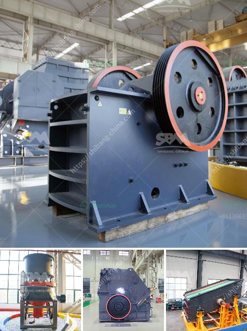

<h3>project cost of mini clinker grinding plant</h3>
The project cost of a mini clinker grinding plant plays a significant role in its overall profitability. While setting up a plant, one must carefully consider both the fixed and variable costs, including labor, raw material, machinery, and other expenses. This article will discuss the various factors that influence the project cost of a mini clinker grinding plant.

1. Size and capacity: The size and capacity of the plant are crucial considerations that directly impact the project cost. A mini clinker grinding plant typically has a smaller production capacity, ranging from 50-100 tonnes per day. These smaller plants consume less energy and require less space for operation, resulting in lower overall project costs compared to larger plants.

2. Location: The location of the plant also affects the project cost. Establishing a plant in urban areas or near transportation hubs may increase land and rental costs. On the other hand, setting up the plant in a remote or rural area might have lower land costs but may entail additional expenses for logistics and transportation. Therefore, selecting the optimal location that balances the factors of cost and convenience is essential.

3. Labor and manpower: The availability and cost of skilled and unskilled labor play a significant role in project cost estimation. Manual labor is required for various tasks, including raw material handling, grinding, packing, and maintenance. Adequate provision for wages, benefits, and safety measures must be accounted for in the cost analysis.

4. Raw material: The cost of raw materials is a key component in project cost estimation. Clinker, the main raw material, should be procured at a competitive price from reliable suppliers. Additionally, other inputs such as gypsum, fly ash, or slag should be considered in the project cost analysis. Proper sourcing and negotiation can help optimize the cost of raw materials.

5. Machinery and equipment: The mini clinker grinding plant requires machinery and equipment for grinding, conveying, packing, and other processes. The cost of these machinery and equipment can vary based on their quality, production capacity, and brand. Investing in efficient and durable machinery can reduce maintenance and replacement costs in the long run.

6. Regulatory requirements: It is crucial to comply with all the necessary regulatory requirements and obtain the required permits and licenses. Any delays or non-compliance can result in legal penalties and cost overruns. Hiring legal and regulatory experts to ensure compliance can impact the project cost.

7. Additional expenses: Apart from the above factors, other miscellaneous costs need to be considered, such as insurance, utilities, initial working capital, marketing, and advertisement expenses. These costs may vary depending on the specific circumstances and local regulations of the project location.

In conclusion, the project cost of a mini clinker grinding plant depends on various factors, including size, location, labor, raw material, machinery, and regulatory requirements. A detailed cost analysis considering these factors is essential for accurately estimating the project cost. By conducting thorough research, negotiations, and feasibility studies, project developers can optimize costs and ensure a profitable venture.
<h3>Contact us</h3><ul><li><strong>Whatsapp:&nbsp;<a href="https://wa.me/8613661969651">+8613661969651</a></strong></li><li><a href="https://swt.shibang-china.com/?git&amp;zhl&amp;project cost of mini clinker grinding plant"><strong>Online Service(chat now)</strong></a></li></ul><h3>Related</h3><ul><li><a href='cost required for mini cement plant.md'>cost required for mini cement plant</a></li><li><a href='mining process of mica crusher.md'>mining process of mica crusher</a></li><li><a href='price of hammer mill.md'>price of hammer mill</a></li><li><a href='nigeria portable crushers.md'>nigeria portable crushers</a></li><li><a href='feldspar stone for sale india.md'>feldspar stone for sale india</a></li></ul>