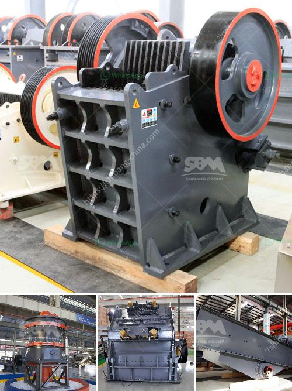

<h3>project report for starting a crusher plant in tamilnadu</h3>
Starting a crusher plant is a challenging task. The presence of multiple legal, environmental, and financial implications makes it crucial to have a comprehensive understanding of the project before commencing construction. This article aims to outline the key factors to consider when preparing a project report for setting up a crusher plant in Tamil Nadu.

To begin with, a project report serves as a blueprint for the project. It presents a detailed analysis of various aspects such as the scope and objectives of the project, estimated costs, resource allocation, and potential risks involved. A well-researched project report not only helps secure necessary approvals from regulatory bodies but also convinces investors and lenders to provide financial support.

The first step in preparing a project report for setting up a crusher plant is to assess the potential market. This includes analyzing the demand and supply conditions for crushed stone aggregates in Tamil Nadu. It is essential to understand the consumer base, construction projects in the region, and the local competition. Gathering this market data will enable the entrepreneur to estimate the plant's production capacity and sales volume.

Once the market analysis is complete, the project report should outline the proposed location for the crusher plant. Factors such as proximity to raw materials, transportation infrastructure, and availability of utilities like water and electricity must be considered. Additionally, compliance with environmental regulations and the potential impact on local communities should be evaluated.

The project report must also provide details regarding the plant's infrastructure and machinery requirements. This includes the size and layout of the plant, necessary construction permits, and the list of machinery needed for operations. The report should emphasize the importance of sourcing reliable and cost-effective equipment to ensure smooth plant operations and high-quality output.

Another crucial aspect of the project report is estimating the financial viability of the crusher plant. This involves analyzing the capital investment required, which includes costs for land, construction, machinery, and working capital. Various financing options, such as loans, equity investments, or government subsidies, should be explored to cover these expenses.

Furthermore, the project report should present a comprehensive financial forecast, including projected revenue, operating costs, and profit margins. It should indicate how the plant intends to generate revenue through product sales, whether through direct sales to construction companies or supplying to distributors. The report should also address the pricing strategy, taking into account the market dynamics and competitive landscape.

Lastly, the project report should discuss the potential risks and mitigation strategies. This includes assessing factors such as market volatility, raw material availability, regulatory changes, and equipment breakdowns. A contingency plan should be outlined to address these risks and ensure uninterrupted plant operation.

In conclusion, starting a crusher plant in Tamil Nadu requires careful planning and meticulous preparation. The project report serves as a guide, addressing various aspects such as market analysis, infrastructure requirements, financial viability, and risk mitigation. By presenting a well-researched and comprehensive report, entrepreneurs can demonstrate their readiness to embark on this venture and attract potential investors and lenders.
<h3>Contact us</h3><ul><li><strong>Whatsapp:&nbsp;<a href="https://wa.me/8613661969651">+8613661969651</a></strong></li><li><a href="https://swt.shibang-china.com/?git&amp;zhl&amp;project report for starting a crusher plant in tamilnadu"><strong>Online Service(chat now)</strong></a></li></ul><h3>Related</h3><ul><li><a href='cost to open a mini cement plant.md'>cost to open a mini cement plant</a></li><li><a href='conveyor belts china.md'>conveyor belts china</a></li><li><a href='stone crusher machine in the philippines for rent.md'>stone crusher machine in the philippines for rent</a></li><li><a href='small ball mill for sale in india.md'>small ball mill for sale in india</a></li><li><a href='gemstone mining crusher in zambia.md'>gemstone mining crusher in zambia</a></li></ul>