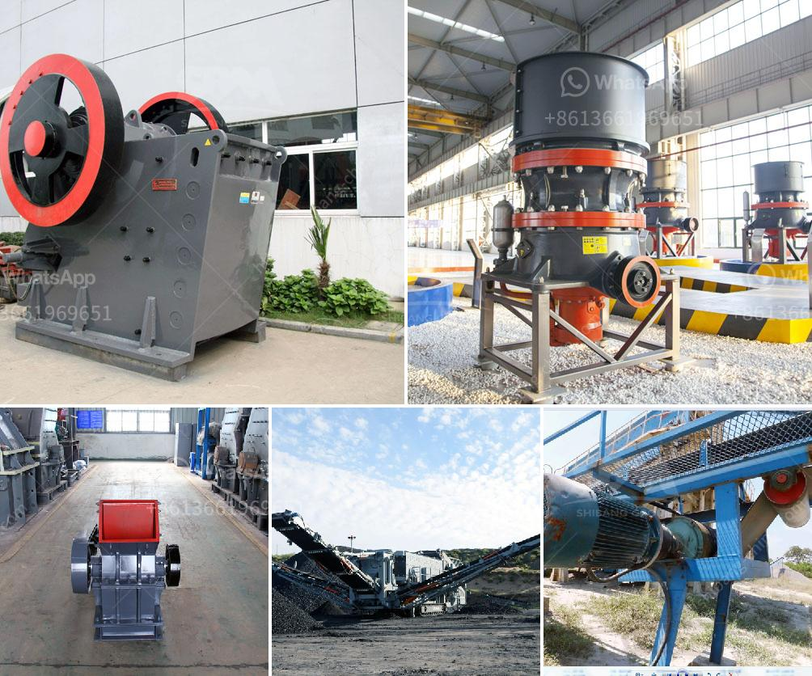

<h3>project report on m sand</h3>
M Sand, also known as manufactured sand, is a fine, white, granular material that is used as a substitute for river sand in construction activities. It is produced by crushing hard granite rocks into fine particles and then washing away the impurities, resulting in a high-quality, consistent material. This project report aims to provide an overview of M Sand and its significance in the construction industry.

One of the primary reasons for the growing popularity of M Sand is its environmental friendliness. Unlike river sand, which is extracted from riverbeds, M Sand does not require any dredging, which can lead to ecological disturbances. Additionally, M Sand has a minimal impact on the local environment as it is produced in controlled conditions and does not involve the use of harmful chemicals.

Another advantage of M Sand is its consistent quality. The production process ensures that the particles have a uniform size and shape, making it ideal for use in concrete and plastering. The uniformity of M Sand also reduces the risk of cracks and defects in the final construction, resulting in stronger, more durable structures.

Furthermore, M Sand offers a cost-effective solution for construction projects. As it is produced locally, the transportation costs are significantly reduced compared to river sand, which is often sourced from distant areas. Moreover, the availability of M Sand throughout the year, regardless of weather conditions, ensures a steady supply and avoids delays in construction schedules.

In terms of performance, M Sand has been found to provide superior strength and durability compared to river sand. It has been extensively tested and approved by various construction authorities, further validating its suitability for different construction applications.

As per industry estimates, the demand for M Sand is expected to witness significant growth in the coming years. Its numerous benefits, coupled with the government's push for sustainable construction practices, have made M Sand the preferred choice for many builders and contractors.

In conclusion, the project report on M Sand highlights its importance as a sustainable and reliable alternative to river sand. The environmental benefits, consistent quality, cost-effectiveness, and superior performance of M Sand make it a highly desirable material for construction projects. With the growing demand for environmentally friendly products, M Sand is poised to play a crucial role in the construction industry in the years to come.
<h3>Contact us</h3><ul><li><strong>Whatsapp:&nbsp;<a href="https://wa.me/8613661969651">+8613661969651</a></strong></li><li><a href="https://swt.shibang-china.com/?git&amp;zhl&amp;project report on m sand"><strong>Online Service(chat now)</strong></a></li></ul><h3>Related</h3><ul><li><a href='limestone ball milling.md'>limestone ball milling</a></li><li><a href='granite feeding equipment manufacturer.md'>granite feeding equipment manufacturer</a></li><li><a href='sand and gravel exploration equipment.md'>sand and gravel exploration equipment</a></li><li><a href='laying of conveyor belting.md'>laying of conveyor belting</a></li><li><a href='copper oxide beneficiation plant china.md'>copper oxide beneficiation plant china</a></li></ul>