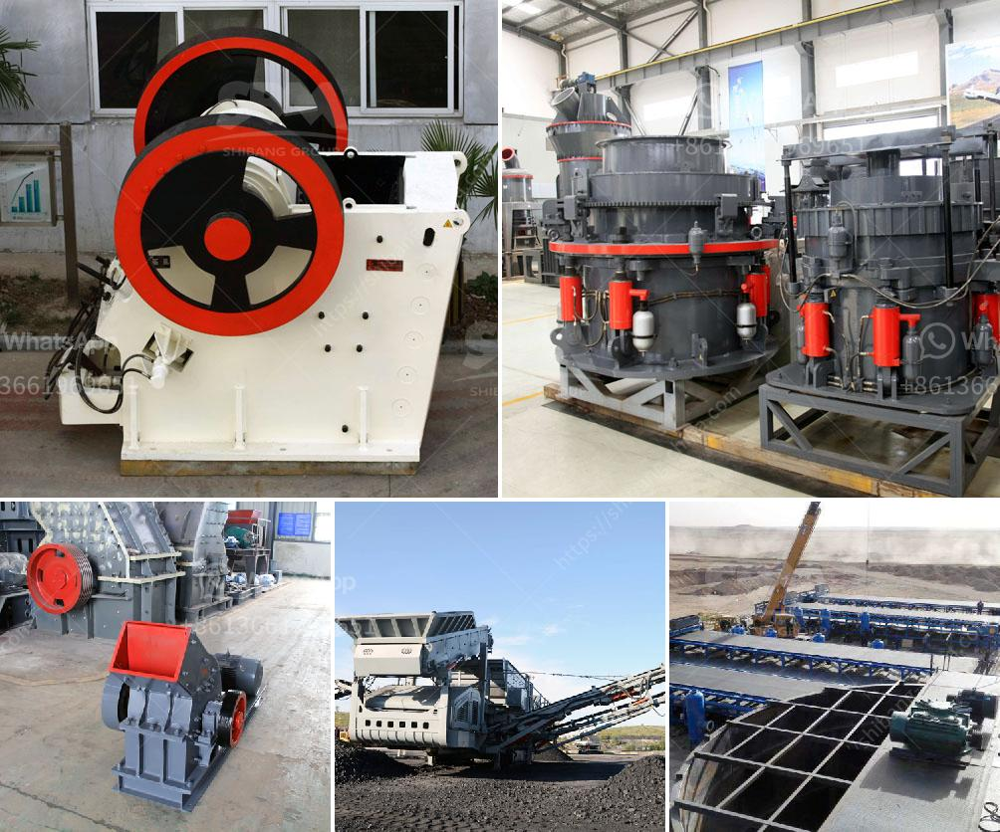

<h3>pulverized coal mill</h3>
The pulverized coal mill is widely used in the industrial sector for grinding and processing coal. It mainly crushes coal blocks into powders, which makes them burn more efficiently and generates high heat. The mill is an essential equipment in the coal-fired power plant.

Coal mills are responsible for the fine grinding of coal, ensuring that the fuel particles are finely ground into a powder form to achieve complete combustion in the boiler. This helps to improve the overall efficiency of the power plant, as the burning rate of coal is much higher in powder form.

The pulverized coal mill consists of a rotating tube filled with cast alloy balls. Coal is introduced into the tube through a central inlet pipe, where it falls onto the rotating grinding table. As the mill rotates, the coal gets crushed between the balls and the grinding table. This crushing action is responsible for the pulverization of coal into a fine powder.

Once pulverized, the coal powder is blown into the combustion chamber of the boiler, where it is ignited to produce heat. Pulverized coal burning provides a more efficient and cleaner method of coal combustion compared to the traditional approach of burning coal in solid chunks.

In addition to improving combustion efficiency, pulverized coal also reduces emissions of harmful pollutants, such as sulfur dioxide and nitrogen oxides. This is due to the fact that pulverized coal burns more efficiently and completely, resulting in lower levels of pollutants being released into the atmosphere.

In conclusion, the pulverized coal mill plays a vital role in coal-fired power plants, as it helps to efficiently grind coal into a fine powder and facilitate complete combustion. This leads to improved overall efficiency and reduced emissions, making it a crucial component in achieving cleaner and more sustainable energy generation from coal.
<h3>Contact us</h3><ul><li><strong>Whatsapp:&nbsp;<a href="https://wa.me/8613661969651">+8613661969651</a></strong></li><li><a href="https://swt.shibang-china.com/?git&amp;zhl&amp;pulverized coal mill"><strong>Online Service(chat now)</strong></a></li></ul><h3>Related</h3><ul><li><a href='coarse ash grinding mill equipment.md'>coarse ash grinding mill equipment</a></li><li><a href='price on a jaw crusher in south africa.md'>price on a jaw crusher in south africa</a></li><li><a href='south africa manufacturer of mobile gold processing plant.md'>south africa manufacturer of mobile gold processing plant</a></li><li><a href='cement process plant crushing machines manufacturer.md'>cement process plant crushing machines manufacturer</a></li><li><a href='sand making machine.md'>sand making machine</a></li></ul>