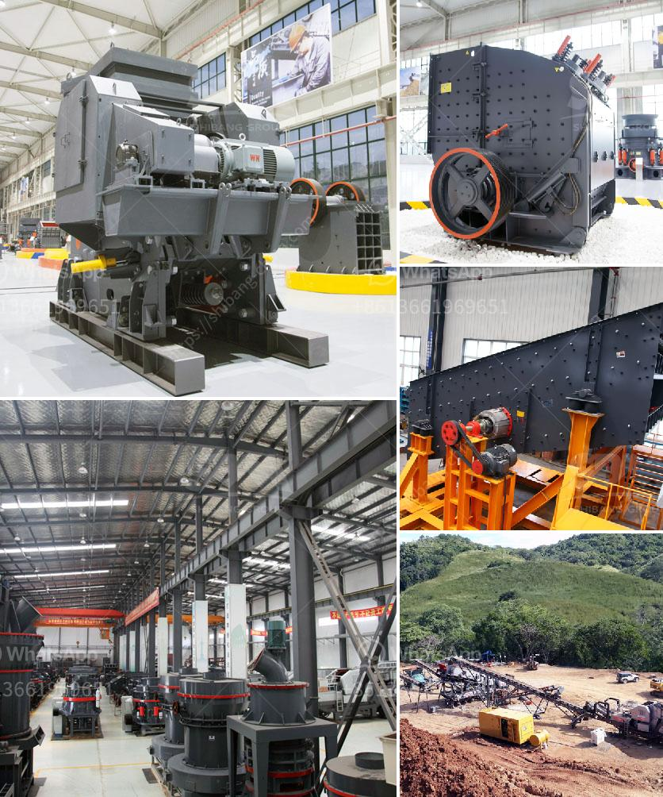

<h3>pulverizer for ultra fine grinding mill</h3>
In the field of industrial manufacturing, grinding is an essential process that enables different raw materials to be transformed into powder form. This process is critical in various industries such as mining, pharmaceuticals, food processing, and chemical manufacturing. A pulverizer is a key piece of equipment in this process, especially when it comes to ultra-fine grinding.

The primary function of a pulverizer is to break large materials into smaller pieces, reducing them to powder form. It achieves this through a combination of force, impact, and attrition. While there are many types of pulverizers available, one of the most efficient and versatile options for ultra-fine grinding is an air-swept pulverizer.

The air-swept pulverizer is designed to grind various materials with a particle size distribution of 80% passing 100 mesh (150 microns) or finer. The mill operates by introducing the material to be pulverized into the grinding chamber where it is subjected to a series of grinding actions by the rotating hammers and the classifier assembly. The centrifugal force generated by the rotating hammers throws the material against the grinding wall, resulting in size reduction through impact and attrition.

What makes the air-swept pulverizer ideal for ultra-fine grinding is its ability to control the final particle size. The mill is equipped with a dynamic classifier that separates the oversized particles from the finished product. The larger particles are returned to the grinding chamber, ensuring that only fine particles exit the mill. This process can be adjusted to achieve the desired particle size distribution, making it suitable for applications that require precise control over product fineness.

Another advantage of the air-swept pulverizer is its high grinding efficiency. The mill is designed to minimize energy consumption and maximize the grinding capacity. Its robust construction and unique design features optimize the airflow pattern and minimize turbulence, allowing the mill to achieve finer grinding at lower energy consumption levels compared to other pulverizers.

Furthermore, the air-swept pulverizer is highly versatile, capable of grinding a wide range of materials. From minerals such as calcium carbonate and gypsum to pharmaceuticals like herbs and spices, the mill can handle different types of materials with ease. This versatility makes it an ideal choice for various industries, allowing them to process different materials using a single machine.

In conclusion, a pulverizer for ultra-fine grinding mill is an essential piece of equipment in various industries. Its ability to efficiently grind different materials, control particle size distribution, and optimize energy consumption sets it apart from other pulverizers. Whether it is used in mining, food processing, or chemical manufacturing, the air-swept pulverizer offers high grinding capacity and precise control over product fineness. With its versatility and efficiency, it is a valuable tool in the manufacturing process.
<h3>Contact us</h3><ul><li><strong>Whatsapp:&nbsp;<a href="https://wa.me/8613661969651">+8613661969651</a></strong></li><li><a href="https://swt.shibang-china.com/?git&amp;zhl&amp;pulverizer for ultra fine grinding mill"><strong>Online Service(chat now)</strong></a></li></ul><h3>Related</h3><ul><li><a href='nigeria jaw crusher.md'>nigeria jaw crusher</a></li><li><a href='write an article about jaw crusher philippines prices with 100300 words.md'>write an article about jaw crusher philippines prices with 100-300 words</a></li><li><a href='sand manufacturing machine price in tamilnadu.md'>sand manufacturing machine price in tamilnadu</a></li><li><a href='slag grinding mill.md'>slag grinding mill</a></li><li><a href='coal crusher types.md'>coal crusher types</a></li></ul>