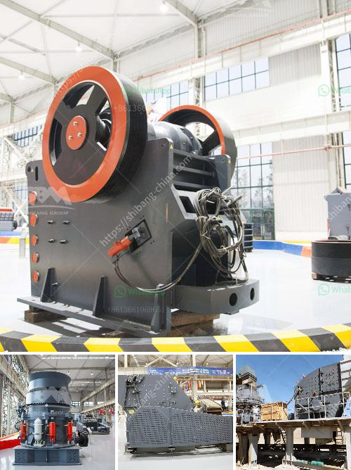

<h3>pulverizers bauxite</h3>
Bauxite is a mineral rich in aluminum oxide, commonly known as alumina. It is a major source of aluminum and is used in various industries such as transportation, packaging, and construction. However, before it can be used, bauxite needs to undergo a complex and energy-intensive refining process.

One crucial step in this process is pulverization. Pulverizers are machines designed to grind bauxite into fine particles, which increases its surface area and facilitates the efficient extraction of alumina. These powerful machines have revolutionized the bauxite processing industry, allowing for faster, more accurate, and cost-effective refining.

The primary purpose of pulverizers is to reduce bauxite to a powdered form suitable for further processing. The bauxite is fed into the pulverizer, where it is ground and crushed by heavy-duty rotating blades. These blades exert immense force on the bauxite, breaking it down into smaller particles. As the bauxite particles become finer, they increase in surface area, making it easier to extract the alumina it contains.

Pulverizers offer several advantages in bauxite processing. Firstly, their high-speed operation allows for efficient grinding, reducing the time required for refining. Faster processing translates into increased production capacity, enabling manufacturers to meet growing demand. Moreover, pulverizers ensure uniform particle size distribution, resulting in a more consistent quality of alumina.

Additionally, pulverizers contribute to cost savings in the bauxite refining process. By reducing particle size, more alumina can be extracted from the same amount of bauxite, maximizing the yield. This means that fewer raw materials are needed, which reduces overall production costs. Furthermore, the lower particle size also minimizes energy consumption during subsequent processing stages, leading to further savings.

The utilization of pulverizers in the bauxite industry has not only improved efficiency and cost-effectiveness but also played a significant role in reducing environmental impact. As they enable better extraction of alumina, less waste material is generated. This reduces the need for storage and disposal of residue, minimizing the ecological footprint.

In conclusion, pulverizers have had a monumental impact on bauxite processing. Their ability to grind bauxite into fine particles has revolutionized the refining process by increasing efficiency, reducing costs, and minimizing environmental impact. The importance of these machines in the bauxite industry cannot be overstated, as they have become an essential tool for manufacturers aiming to produce high-quality alumina in a sustainable manner.
<h3>Contact us</h3><ul><li><strong>Whatsapp:&nbsp;<a href="https://wa.me/8613661969651">+8613661969651</a></strong></li><li><a href="https://swt.shibang-china.com/?git&amp;zhl&amp;pulverizers bauxite"><strong>Online Service(chat now)</strong></a></li></ul><h3>Related</h3><ul><li><a href='coal mill in malaysia.md'>coal mill in malaysia</a></li><li><a href='stone crusher machine spintex accra.md'>stone crusher machine spintex accra</a></li><li><a href='quarrying crusher in zimbia.md'>quarrying crusher in zimbia</a></li><li><a href='sand making machine.md'>sand making machine</a></li><li><a href='grinding of ceramic minerals.md'>grinding of ceramic minerals</a></li></ul>