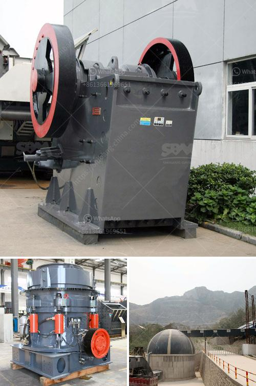

<h3>puzzolana jaw crusher price in india</h3>
Puzzolana, a reputed brand name in Infra segment is a diversified group with five decades of enviable history in delivering effective, economic & environmentally compatible engineering solutions to infrastructure challenges, A truly 'Make in India' organisation with multi-disciplined tasks like Design, Manufacture, Supply, Installation and Commissioning on Turnkey Basis. And a promise to you, the customer - meeting your exacting requirements with the most versatile range of Puzzolana machinery and innovative surface mining, recycling and dredging technologies.

Puzzolana Jaw Crushers are Heavy duty Fabricated design handling Hard Rock with bigger feed Size - reduces mining cost. Primary Station extension hopper is supported from outside there by no vibrations transferred from Crusher. Platform for Jaw Crusher and beam for lifting arrangement of heavy Jaw Plates. Capacity: 120 TPH to 750 TPH

Puzzolana Mobility expands options. The mighty series of jaw crushers are designed to meet the toughest demands of primary crushing applications with their impressive power, reliability and proven performance. The semi mobile single toggle jaw crushing plant with all necessary mechanical & electrical components, support structure & protection devices combines high flexibility with great efficiency in primary crushing applications.

The Jaw crusher can deliver up to 25% more tones per hour (tph) than other comparable crushers. Downtime is dead time. The jaw crusher is engineered to maximize uptime Base construction. Heavy-duty, single-sided base construction Stress relieved to regain original strength properties Heavy-duty flywheels are large, dynamically balanced

Puzzolana is one of the renowned organizations engaged in manufacturing and supplying crushing and screening plants are cement plants, particularly lime stone and dolomite up to capacity of 1500 TPH. Presence across country and in the neighboring countries has been established by us. Backed by a team of experts, we are engaged in providing a high degree of flexibility to our manufacturing process. This helps us to cater to the requirements of our clients effectively and timely.

In conclusion, Puzzolana Jaw Crushers are highly efficient crushing machines, which can be controlled by one operator with minimal effort. These machines are known for their performance and are extremely reliable and easy to operate.
<h3>Contact us</h3><ul><li><strong>Whatsapp:&nbsp;<a href="https://wa.me/8613661969651">+8613661969651</a></strong></li><li><a href="https://swt.shibang-china.com/?git&amp;zhl&amp;puzzolana jaw crusher price in india"><strong>Online Service(chat now)</strong></a></li></ul><h3>Related</h3><ul><li><a href='vibrating screen consumption.md'>vibrating screen consumption</a></li><li><a href='fine powder grinding machine philippines.md'>fine powder grinding machine philippines</a></li><li><a href='pebble crushing plant.md'>pebble crushing plant</a></li><li><a href='cement production procedure in vertical mill.md'>cement production procedure in vertical mill</a></li><li><a href='limestone crusher china.md'>limestone crusher china</a></li></ul>