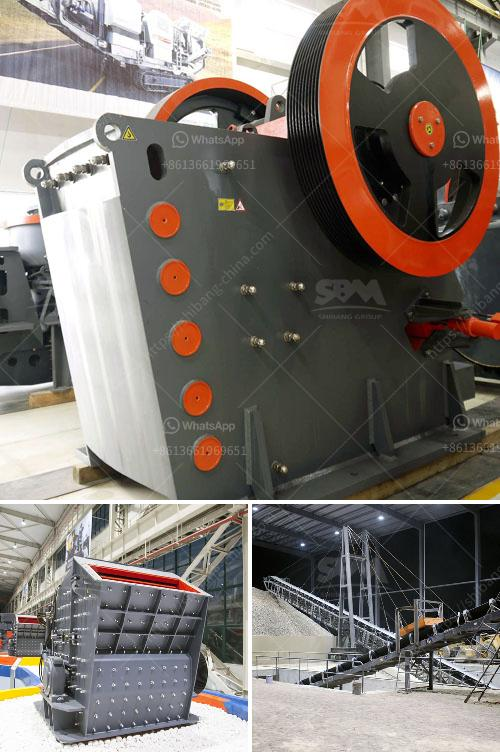

<h3>pyrite coal mill pakistan</h3>
Pakistan is a rapidly developing country with an abundance of natural resources and a growing energy demand. In recent years, the country has witnessed a surge in coal-based power generation to meet its increasing electricity needs. Among the various types of coal found in Pakistan, pyrite coal stands out due to its unique properties and potential benefits.

Pyrite coal contains a significant amount of sulfur, a mineral that has led to its categorization as a high-sulfur coal. Although high in sulfur, pyrite coal also possesses a high heating value, making it an attractive option for industrial processes and power generation. However, the utilization of pyrite coal requires efficient and specialized machinery, such as a dedicated pyrite coal mill, to effectively extract its energy content.

One of the leading pyrite coal mills in Pakistan is located in the Sindh province, near Thar, a region known for its vast coal reserves. The mill, equipped with advanced technology and machinery, has the capability to process large quantities of pyrite coal efficiently. It grinds the coal to a fine powder, enabling its combustion in a controlled manner to produce heat and electricity.

The utilization of pyrite coal has several advantages. Firstly, its abundance in Pakistan makes it a cost-effective solution for power generation. The country can rely on its own natural resources and reduce its dependency on costly imports. Moreover, the use of pyrite coal stimulates the local economy, creating job opportunities and supporting the coal mining industry.

The high sulfur content in pyrite coal, although a challenge, can be managed effectively. By implementing effective emission control technologies, sulfur dioxide emissions can be minimized, reducing the negative environmental impact. Furthermore, ongoing research and development efforts are focused on finding ways to harness the potential of pyrite coal while minimizing its environmental footprint.

The pyrite coal mill in Pakistan has been instrumental in meeting the country's energy needs and reducing its reliance on traditional sources such as gas and oil. As a developing nation, Pakistan understands the importance of diversifying its energy mix and exploring alternative sources. The utilization of pyrite coal provides an opportunity to tap into a domestic resource and improve energy security.

However, it is crucial to strike a balance between energy needs and environmental concerns. The government must enforce stringent regulations and encourage the use of cleaner technologies to mitigate the environmental impact of pyrite coal utilization. Ongoing investments in research and development will also drive innovation in emission control technologies and ultimately make the utilization of pyrite coal more sustainable.

In conclusion, the pyrite coal mill in Pakistan plays a crucial role in the country's energy landscape. Its utilization offers cost-effective and domestic energy solutions, while also stimulating the local economy. With proper regulations and investments in clean technologies, the environmental impact of pyrite coal utilization can be minimized. Pakistan is heading towards a sustainable future by tapping into its natural resources and diversifying its energy mix.
<h3>Contact us</h3><ul><li><strong>Whatsapp:&nbsp;<a href="https://wa.me/8613661969651">+8613661969651</a></strong></li><li><a href="https://swt.shibang-china.com/?git&amp;zhl&amp;pyrite coal mill pakistan"><strong>Online Service(chat now)</strong></a></li></ul><h3>Related</h3><ul><li><a href='limestone crushing processing for the manufacture.md'>limestone crushing processing for the manufacture</a></li><li><a href='concrete crusher in kenya for sale.md'>concrete crusher in kenya for sale</a></li><li><a href='marble crusher price.md'>marble crusher price</a></li><li><a href='crusher equipment for sale.md'>crusher equipment for sale</a></li><li><a href='ball mill design calculation pdf.md'>ball mill design calculation pdf</a></li></ul>