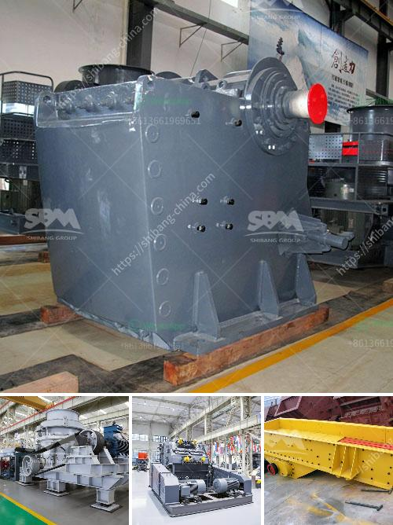

<h3>quarring of building stones crusher in pakistan</h3>
Quarrying of building stones is widespread across the globe, and as such, it has contributed immensely to the growth of nations. Multitudes of structures, roads, and landmarks throughout history have been constructed with a variety of natural stones. In Pakistan, quarrying of building stones is a significant industry in terms of both its value and volume.

Pakistan is home to many types of rocks suitable for construction purposes, including marble, granite, limestone, slate, sandstone, and travertine. This rich diversity of stones provides ample opportunities for the local construction industry to utilize indigenous materials and reduce dependency on imports. Therefore, quarrying of building stones in Pakistan plays a vital role in promoting economic growth and developing sustainable infrastructure.

The quarrying process involves several stages, starting with stripping the overburden, or topsoil, from the mine site. This layer of soil is carefully stripped away to expose the underlying rock formations. Once the overburden is removed, drilling is done to create blastholes, which are filled with explosives. Controlled blasting is conducted to break the rock into manageable sizes for extraction.

Once the rock is extracted, it undergoes various processes to transform it into usable building stones. The primary crushing stage involves the use of jaw crushers. These machines take large rocks and break them down into smaller, more manageable pieces. Secondary crushers further reduce the size of the stones to the desired levels.

After the initial crushing process, the stones are sorted by size using vibrating screens. This ensures that the final product meets the required specifications for different construction applications. Depending on the specific requirements, the stones are further processed through milling, shaping, polishing, or cutting to achieve the desired finish.

One of the most significant benefits of quarrying building stones in Pakistan is the boost it provides to the local economy. Quarrying creates job opportunities for the local workforce and contributes to the national GDP. It also promotes other related industries, such as transportation, equipment manufacturing, and stone processing. The revenue generated from the sector helps in funding public infrastructure projects, education, and healthcare facilities.

Quarrying of building stones also supports sustainable development in Pakistan. By utilizing indigenous materials, the construction industry reduces the cost of importing stones, which often have to travel long distances. This reduces the carbon footprint associated with transportation and helps in conserving energy and the environment.

However, it is essential to note that quarrying also poses certain challenges that need to be addressed. One of the primary concerns is the impact on the environment. Quarrying activities can cause noise and air pollution, soil erosion, and the destruction of natural habitats. Responsible quarrying practices, including proper land reclamation and effective waste management, should be implemented to minimize these adverse effects.

To conclude, quarrying of building stones in Pakistan is a significant sector that contributes to the country's economy and infrastructure development. The abundance of natural stones in the region allows for sustainable construction practices, reduces dependency on imports, and promotes local job creation. However, the industry must ensure responsible quarrying practices to mitigate the environmental impact and ensure the sustainability of natural resources for future generations.
<h3>Contact us</h3><ul><li><strong>Whatsapp:&nbsp;<a href="https://wa.me/8613661969651">+8613661969651</a></strong></li><li><a href="https://swt.shibang-china.com/?git&amp;zhl&amp;quarring of building stones crusher in pakistan"><strong>Online Service(chat now)</strong></a></li></ul><h3>Related</h3><ul><li><a href='coal washing plant spirals pdf.md'>coal washing plant spirals pdf</a></li><li><a href='hammer mill capacity 80 ton per hour.md'>hammer mill capacity 80 ton per hour</a></li><li><a href='japan jaw crusher price.md'>japan jaw crusher price</a></li><li><a href='stone crushing machines.md'>stone crushing machines</a></li><li><a href='mobile crusher for.md'>mobile crusher for</a></li></ul>