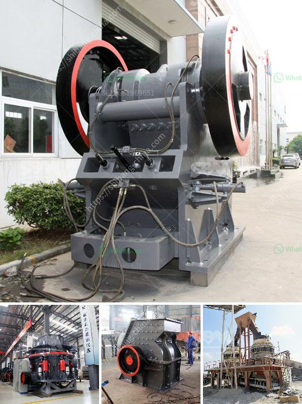

<h3>quarry crusher cost</h3>
When it comes to investing in a quarry crusher plant, it often pays to consider the overall cost involved. While there may be various factors to consider, such as the machine's capacity, power output, and optional features, one of the most critical factors is the upfront cost of the machine. This cost, however, is only one piece of the puzzle.

The quarry crusher cost comprises more than just the purchase price. Taking into account the reputation and longevity of the supplier, the durability and efficiency of the equipment, and the ongoing maintenance and safe operation of the machinery, the real cost of the investment becomes apparent. By evaluating these crucial factors, businesses can make informed decisions that will ultimately impact their profitability and productivity.

One aspect that warrants careful consideration is the supplier's reputation. It is essential to choose a reputable manufacturer or supplier with a proven track record. A well-established supplier will be more likely to offer quality, reliable equipment and excellent after-sales service. On the other hand, opting for a supplier solely based on a lower price may result in frequent breakdowns, costly repairs, and ultimately, a shorter lifespan of the crusher, causing further financial strains.

Durability and efficiency are also key factors in determining the true cost of a quarry crusher plant. Investing in a machine that is built to withstand the rigorous demands of a quarry operation will ensure minimal downtime and increased productivity. Additionally, it is crucial to select a crusher with high energy efficiency, as this will translate into lower operating costs in the long run.

Lastly, ongoing maintenance and safe operation of the machinery must be considered. Neglecting routine maintenance can lead to significant breakdowns and unplanned downtime, adversely affecting productivity and profitability. Moreover, ensuring safe operation through proper training and compliance with health and safety regulations is vital, as it minimizes accidents and potential legal consequences.

To conclude, when evaluating the quarry crusher cost, it is imperative to look beyond the initial purchase price. By considering the supplier's reputation, the durability and efficiency of the machine, and the ongoing maintenance requirements, businesses can make an informed decision that will positively impact their bottom line. Investing in a high-quality quarry crusher plant may be accompanied by a higher upfront cost, but it pays off in terms of long-term reliability, productivity, and ultimately, a higher return on investment.
<h3>Contact us</h3><ul><li><strong>Whatsapp:&nbsp;<a href="https://wa.me/8613661969651">+8613661969651</a></strong></li><li><a href="https://swt.shibang-china.com/?git&amp;zhl&amp;quarry crusher cost"><strong>Online Service(chat now)</strong></a></li></ul><h3>Related</h3><ul><li><a href='marbel grinding machine.md'>marbel grinding machine</a></li><li><a href='sandstone sand making machine manufacturer.md'>sandstone sand making machine manufacturer</a></li><li><a href='crusher stone plant limpopo.md'>crusher stone plant limpopo</a></li><li><a href='law requirements in stone crushing industry.md'>law requirements in stone crushing industry</a></li><li><a href='mobile crushing and screening.md'>mobile crushing and screening</a></li></ul>