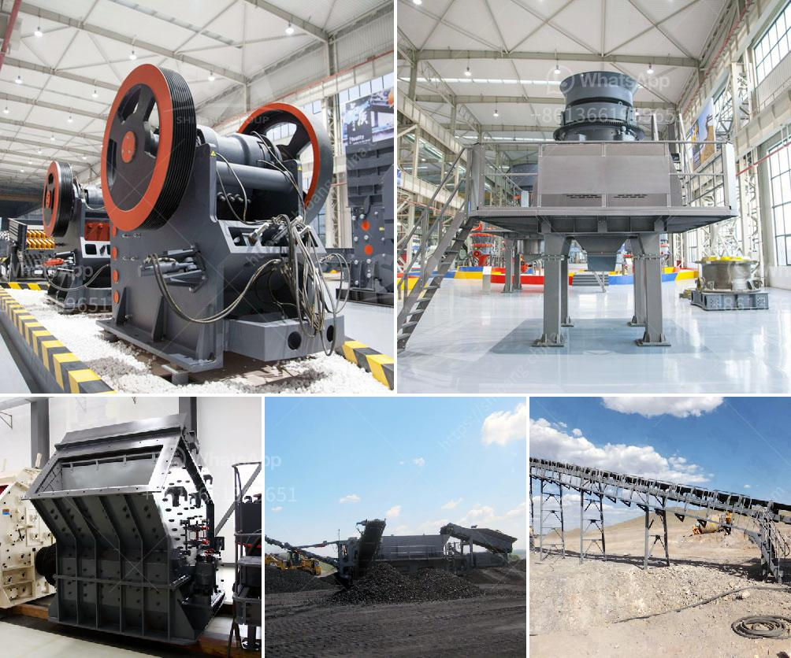

<h3>quarry crusher equipment for sale in south africa</h3>
Quarrying is one of the major activities in producing materials for construction purposes in South Africa. Quarrying involves the extraction of rocks and other materials from the earth's surface which are then used for various industrial purposes. One of the most important pieces of equipment used in the quarrying process is the crusher equipment.

Crusher equipment is used for crushing rocks and stones to produce aggregates for construction purposes. The crushed material is used as a base for roads, buildings, bridges, and other infrastructures. As the demand for construction materials increases in South Africa, the need for quarry crusher equipment has also increased.

Quarry crusher equipment has its own advantages and disadvantages, due to the nature and structure of quarry rocks. The major advantage of quarrying is the ability to produce high-quality aggregate materials used in construction. Another advantage is the feeding size of the crusher equipment is relatively small, which reduces the size of the material that needs to be processed. This increases efficiency and reduces the energy required for crushing.

There are several types of quarry crusher equipment available in South Africa. Some of them are specialized in crushing materials of different sizes and hardness levels. These crusher machines are usually stationary, mounted on a foundation. They are operated manually or with the help of electricity.

One of the popular crusher equipment in South Africa is the jaw crusher machine. This machine is usually used in the first step of the quarrying process. The jaw crusher is a robust and reliable machine designed to crush rocks into a manageable size. The jaw crusher can crush rocks up to 1.2m in diameter and produce up to 250ton/hour depending on the size and hardness of the material being crushed.

Another popular type of quarry crusher equipment in South Africa is the cone crusher machine. Cone crushers are often used in medium and fine crushing processes, delivering an excellent particle shape and size reduction ratio. The cone crusher is typically operated by a motor and driven by a belt. It crushes rocks by squeezing them between the mantle and concave, which are lined with wear-resistant manganese steel.

Besides, impact crusher equipment is also commonly used in quarries in South Africa. The impact crusher is ideal for crushing materials with a high compressive strength under 350MPa. It can crush materials into a small size of below 70mm, which makes it an ideal choice for the second or third stage of the crushing process. The impact crusher uses impact force to break rocks and stones, creating a high-quality end product.

Overall, quarry crusher equipment plays a vital role in the machinery industry and in the production of aggregates for various construction purposes. The availability of these machines in the market has made it easier for construction companies and quarrying businesses in South Africa to meet the ever-increasing demand for high-quality aggregates. Buyers should consider factors like the crusher's capacity, efficiency, and maintenance requirements when purchasing quarry crusher equipment. With the right equipment, quarrying operations in South Africa can be carried out more efficiently, leading to increased productivity and profitability.
<h3>Contact us</h3><ul><li><strong>Whatsapp:&nbsp;<a href="https://wa.me/8613661969651">+8613661969651</a></strong></li><li><a href="https://swt.shibang-china.com/?git&amp;zhl&amp;quarry crusher equipment for sale in south africa"><strong>Online Service(chat now)</strong></a></li></ul><h3>Related</h3><ul><li><a href='pulverized coal mill.md'>pulverized coal mill</a></li><li><a href='used small gold processing plant from dubai.md'>used small gold processing plant from dubai</a></li><li><a href='conveyor belt indonesia.md'>conveyor belt indonesia</a></li><li><a href='cone crusher that is a cone crusher.md'>cone crusher that is a cone crusher</a></li><li><a href='crusher machines supplier in philippines.md'>crusher machines supplier in philippines</a></li></ul>