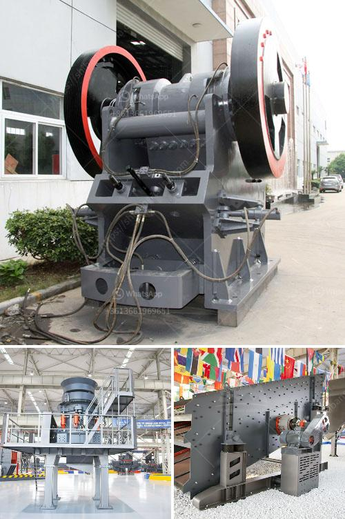

<h3>quarry crusher equipment process</h3>
Quarrying is often a complex process that begins with mining of the ore (rock) from the Earth's crust. The process is straightforward; miners source valuable ores such as granite, limestone, and sandstone from the ground, making them ready for subsequent processing. Quarry crusher equipment uses the machinery this process demands to break rock into finer portions, offering an efficient and low-cost means of processing minerals.

Modern quarrying techniques depend on the rock types to be extracted. For instance, sandstone is quarried by splitting the rock using pneumatic or hydraulic drills. Limestone, however, is extracted using specialized machinery to crush and separate the rock. The quarry crusher equipment process is carefully designed based on the rock type and customer requirements so that the final outcome fulfills the desired specifications.

The primary task involved in quarrying is the crushing of the rocks. This is followed by the separation of the valuable minerals from the unwanted rock pieces with the help of various screening equipment. The quarry crusher processes may involve several stages of crushing, each of which achieves smaller rock sizes while maintaining efficiency. These stages could be jaw crushers, cone crushers, or impact crushers, depending on the desired output size and rock type.

In addition to the crushing process, quarry crusher equipment also involves screening to separate fine particles from larger rocks. The screening equipment utilizes a straightforward but highly effective mechanism that sorts the rock fragments based on their size. This screening process is essential to ensure that the final product meets specific requirements, such as size, density, and composition, before being transported for further processing or sale.

Overall, quarry crusher equipment plays a critical role in the quarrying process. It effectively breaks down the rocks into smaller, manageable sizes and ensures the separation of valuable materials. The equipment's efficiency and precision contribute significantly to the profitability and sustainability of any quarrying operation. Therefore, investing in reliable quarry crusher equipment is crucial for any mining company aiming to optimize productivity and minimize operational costs.
<h3>Contact us</h3><ul><li><strong>Whatsapp:&nbsp;<a href="https://wa.me/8613661969651">+8613661969651</a></strong></li><li><a href="https://swt.shibang-china.com/?git&amp;zhl&amp;quarry crusher equipment process"><strong>Online Service(chat now)</strong></a></li></ul><h3>Related</h3><ul><li><a href='european manufacturer mining equipment crusher screens.md'>european manufacturer mining equipment crusher screens</a></li><li><a href='advantages of single toggle jaw crusher.md'>advantages of single toggle jaw crusher</a></li><li><a href='small jaw crushers.md'>small jaw crushers</a></li><li><a href='how to make stone crusher plant.md'>how to make stone crusher plant</a></li><li><a href='stone crusher plant 100tph layout.md'>stone crusher plant 100tph layout</a></li></ul>