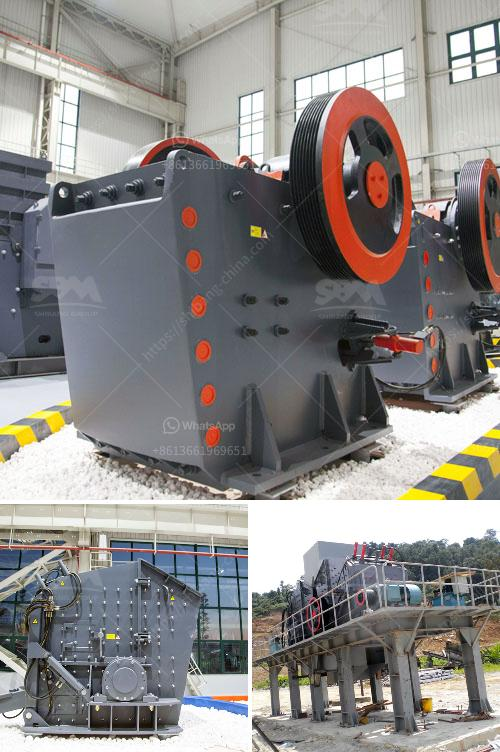

<h3>quarry crusher equipment supplier</h3>
Quarrying is a process of extracting stones, rocks, and other materials from an open-pit mine or quarry. Quarrying operations require the use of specialized equipment, including crushers, to efficiently and effectively crush and break down the material. 

One crucial piece of equipment in the quarrying industry is the quarry crusher, which enables the extraction of materials by breaking them down into smaller, more manageable sizes. These crushers are designed to crush larger rocks or stones into smaller pieces to be used for construction or other purposes.

Choosing the right quarry crusher equipment supplier is essential to ensuring that the desired product quality and production efficiency are met. An experienced and reliable supplier will provide quarry operators with the necessary equipment that meets their specific needs and requirements.

There are various factors to consider when selecting a quarry crusher equipment supplier. First and foremost, the supplier should have a strong reputation within the industry. Reputation is built on trust, reliability, and the ability to deliver high-quality products consistently.

A reputable supplier should also offer a wide range of quarry crusher equipment options, suited to different types of materials and production requirements. This allows quarry operators to select the most suitable crusher for their specific needs.

Another crucial factor to consider is the availability of spare parts and after-sales support. Quarry crushers are subject to wear and tear, and regular maintenance and servicing are essential to ensure their optimal performance. A reliable supplier should have a readily available stock of spare parts and offer efficient after-sales support to minimize downtime.

Additionally, it is important to consider the supplier's track record and experience in the quarrying industry. A supplier with extensive experience in supplying quarry crusher equipment can provide valuable insights and guidance to optimize crushing operations and improve overall productivity.

Cost is also an important consideration. It is advisable to obtain quotes from different suppliers and compare them to ensure that the chosen supplier offers competitive prices without compromising on quality.

Furthermore, environmental considerations should be taken into account. Quarrying operations can have a significant impact on the environment, and choosing a supplier that offers environmentally friendly crusher equipment, such as those with lower noise and dust emissions, is essential for sustainable quarrying practices.

In conclusion, choosing the right quarry crusher equipment supplier is crucial for the success of quarrying operations. A reputable supplier with a strong reputation, a wide range of equipment options, availability of spare parts and after-sales support, industry experience, competitive pricing, and a focus on environmental sustainability is essential. By partnering with a reliable supplier, quarry operators can ensure that their crushing operations are efficient, productive, and environmentally responsible.
<h3>Contact us</h3><ul><li><strong>Whatsapp:&nbsp;<a href="https://wa.me/8613661969651">+8613661969651</a></strong></li><li><a href="https://swt.shibang-china.com/?git&amp;zhl&amp;quarry crusher equipment supplier"><strong>Online Service(chat now)</strong></a></li></ul><h3>Related</h3><ul><li><a href='service de carbonate de calcium de broyage.md'>service de carbonate de calcium de broyage</a></li><li><a href='talcum powder supplier for production.md'>talcum powder supplier for production</a></li><li><a href='ball mills prices.md'>ball mills prices</a></li><li><a href='hammer mill ghana.md'>hammer mill ghana</a></li><li><a href='stone crusher in stone.md'>stone crusher in stone</a></li></ul>