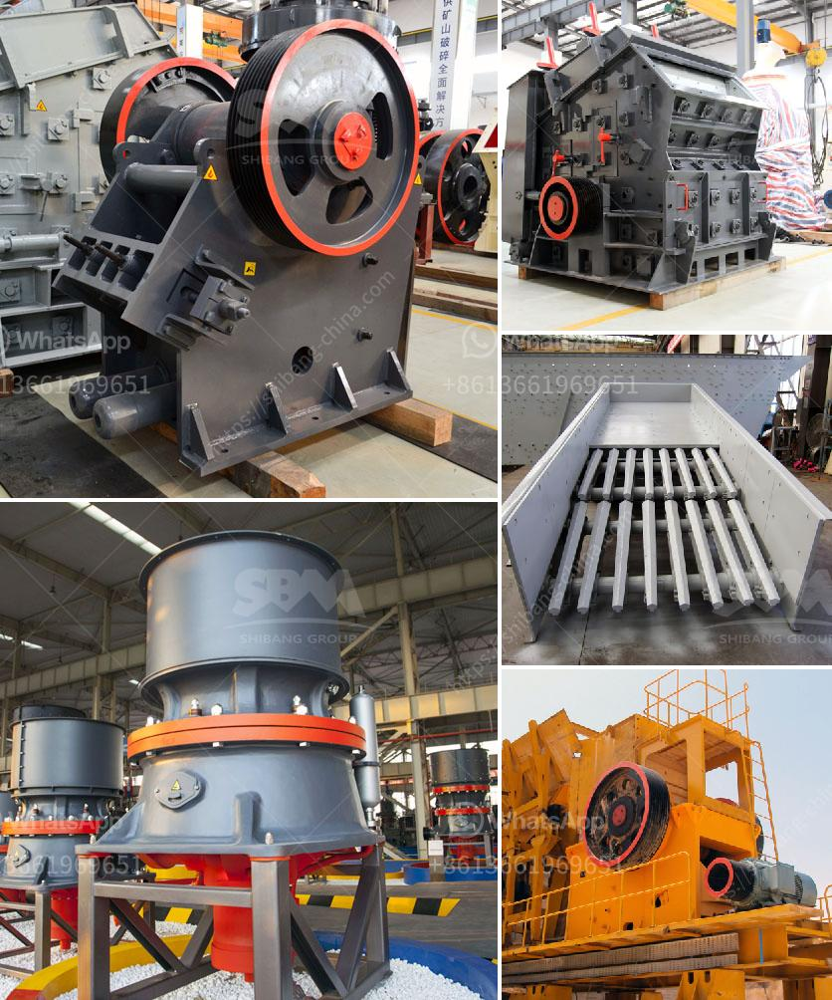

<h3>quarry crusher machine price</h3>
One of the most critical aspects to consider when investing in a quarry crusher machine is the price. The price of the crusher machine is an important factor to consider before investing in one. Therefore, understanding the importance of the price is vital in determining the overall value of the machine.

Quarrying operations involve crushing, screening, and producing various materials for construction purposes. Quarry crushers play a significant role in this process. Since quarrying is a labor-intensive industry, investing in a robust and reliable crusher machine will keep the operation running smoothly and efficiently.

The price of a quarry crusher machine varies significantly based on several factors. These factors include the capacity, material size, desired product specifications, energy consumption, and machine durability. All of these factors contribute to the overall price of the machine.

Capacity is an essential factor to consider when looking at quarry crusher machine prices. Determining the required capacity will help calculate the cost of the machine since higher capacity machines tend to be more expensive. It is essential to choose a crusher machine with a capacity that meets the production needs without investing in an oversized machine.

Material size also affects the price of quarry crusher machines. Different crushers are designed to handle different types of materials, such as rocks, gravel, or minerals. Machines that handle harder materials tend to be more expensive than those designed for softer materials.

Product specifications also play a role in determining the price of quarry crusher machines. Some customers may require specific product sizes or shapes. Crushers that can produce precise and consistent product specifications tend to come at a higher price due to their added functionalities and features.

Energy consumption is another crucial factor to consider when looking at quarry crusher machine prices. Machines with higher energy efficiency ratings may have a higher initial price but can reduce operating costs in the long run. Investing in an energy-efficient machine can lead to significant savings on electricity bills.

Machine durability is an essential factor that directly impacts the overall cost of a quarry crusher machine. Durability refers to the machine's ability to withstand demanding working conditions and regular wear and tear. Machines built with high-quality materials and robust construction tend to have a higher upfront cost but require fewer repairs and replacements in the long term.

It is essential to consider all these factors when determining the price of a quarry crusher machine. A higher initial investment in a durable, high-capacity, energy-efficient machine may lead to long-term cost savings. On the other hand, a cheaper machine with lower capacity, poor durability, or higher energy consumption may ultimately become more expensive due to frequent repairs and replacements.

To conclude, the price of a quarry crusher machine should be carefully considered before making a purchase. Capacity, material size, desired product specifications, energy consumption, and machine durability are all crucial factors that determine the overall value of the machine. By investing wisely in a reliable and efficient crusher machine, quarrying operations can prosper and achieve long-term success.
<h3>Contact us</h3><ul><li><strong>Whatsapp:&nbsp;<a href="https://wa.me/8613661969651">+8613661969651</a></strong></li><li><a href="https://swt.shibang-china.com/?git&amp;zhl&amp;quarry crusher machine price"><strong>Online Service(chat now)</strong></a></li></ul><h3>Related</h3><ul><li><a href='how to use hammer mill.md'>how to use hammer mill</a></li><li><a href='ball mill making from turkey.md'>ball mill making from turkey</a></li><li><a href='stone crusher manufacturers.md'>stone crusher manufacturers</a></li><li><a href='iron ore upgrading plant equipment.md'>iron ore upgrading plant equipment</a></li><li><a href='second hand jaw crusher for sale in harare.md'>second hand jaw crusher for sale in harare</a></li></ul>