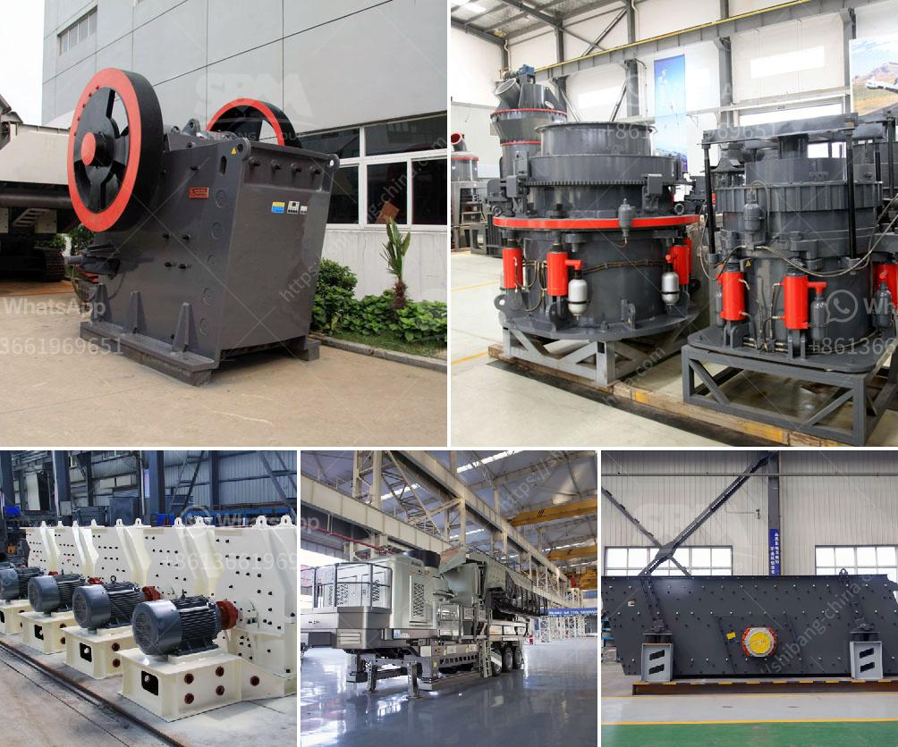

<h3>quarry equipment in kenya</h3>
Quarrying is an integral part of the building and construction industry in Kenya and specifically in the Nairobi area. The stone quarrying industry has been growing rapidly due to the increased demand for sand and aggregate for the construction of infrastructure projects such as roads, buildings, and bridges.

To meet this growing demand, quarry owners in Kenya have invested in various types of equipment to ensure that their operations are efficient and productive. These equipment range from large excavators and trucks for hauling materials to rock crushers and screening machines for breaking down and sorting the stones. Other equipment includes drilling machines for extracting stones from the ground and loaders for transporting the stones within the quarry.

One of the key considerations when investing in quarry equipment in Kenya is the operational cost involved. The cost of equipment maintenance, fuel, and labor can substantially affect the profitability of a quarry business. Therefore, quarry owners must carefully consider the efficiency and reliability of the equipment they purchase to minimize operating costs.

Another important factor to consider is the environmental impact of quarry operations. Quarrying can have adverse effects on the environment, including noise pollution, dust emissions, and soil erosion. Therefore, quarry equipment with advanced technology and features that minimize these impacts are highly sought after in Kenya.

Additionally, the availability of spare parts and after-sales support is crucial when selecting quarry equipment. Equipment breakdowns are inevitable, and a reliable supplier who can provide prompt and efficient servicing and repairs is essential to minimize downtime and ensure continuous operation.

In conclusion, the quarry equipment market in Kenya is experiencing continued growth due to the rising demand for construction materials. Quarry owners are investing in modern and efficient equipment to ensure profitability and sustainability. However, they should also prioritize environmental considerations and choose suppliers who can provide reliable equipment and support services.
<h3>Contact us</h3><ul><li><strong>Whatsapp:&nbsp;<a href="https://wa.me/8613661969651">+8613661969651</a></strong></li><li><a href="https://swt.shibang-china.com/?git&amp;zhl&amp;quarry equipment in kenya"><strong>Online Service(chat now)</strong></a></li></ul><h3>Related</h3><ul><li><a href='powder making machine south africa.md'>powder making machine south africa</a></li><li><a href='price list for crusher machine sayaji.md'>price list for crusher machine sayaji</a></li><li><a href='diagram of a hammer mill.md'>diagram of a hammer mill</a></li><li><a href='quarring of building stones crusher in pakistan.md'>quarring of building stones crusher in pakistan</a></li><li><a href='16 mesh silica sand crusher.md'>16 mesh silica sand crusher</a></li></ul>