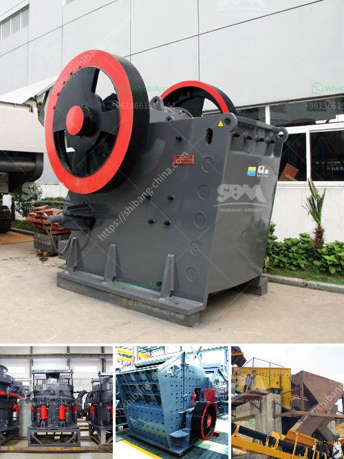

<h3>quarry equipment suppliers miami</h3>
The construction industry is one of the main driving forces behind economic growth and development in Miami. As the city continues to undergo rapid urbanization and infrastructural expansion, the demand for high-quality quarry equipment is becoming increasingly important. Quarry equipment suppliers in Miami play a crucial role in ensuring that construction companies have access to reliable tools and machinery, enabling them to carry out their projects efficiently and effectively.

Quarry equipment suppliers offer a wide range of machinery and tools necessary for extracting, crushing, and screening various types of stones and minerals. These supplies are indispensable for the construction of roads, sidewalks, buildings, and other infrastructure projects. Without the proper equipment, construction companies would struggle to complete their projects on time and within budget.

One of the primary types of quarry equipment supplied by Miami suppliers includes crushers. Crushers are robust machines designed to break down large rocks into smaller, more manageable sizes. These machines are essential for the quarrying process, as they reduce the size of the extracted materials, making it easier to transport and process them further. By working closely with quarry equipment suppliers in Miami, construction companies can ensure that they have access to high-quality, reliable crushers that meet their specific project requirements.

In addition to crushers, quarry equipment suppliers also provide screening machines. These machines are used to separate different-sized stones and minerals, ensuring that only the desired output is used for construction purposes. Screening machines play a crucial role in the efficiency of quarry operations, as they allow construction companies to achieve the desired product quality while minimizing unnecessary waste.

While crushers and screening machines are the primary focus of quarry equipment suppliers in Miami, they also provide a range of other essential tools and machinery. These may include excavators, wheel loaders, bulldozers, and dump trucks, to name a few. Excavators are used for digging and loading materials, while wheel loaders assist in the transportation of rocks and minerals within the quarry site. Bulldozers facilitate the leveling of the quarrying area, and dump trucks are responsible for the safe transportation of materials from the quarry to their respective destinations.

Quarry equipment suppliers in Miami are committed to providing construction companies with the highest quality equipment available on the market. They source their machinery from reputable manufacturers, ensuring that the products they supply are durable, efficient, and reliable. By partnering with these suppliers, construction companies can maximize their productivity and meet the demands of their projects.

In conclusion, quarry equipment suppliers in Miami play a vital role in supporting the growth and development of the construction industry. By providing essential tools and machinery, they enable construction companies to carry out their projects efficiently and effectively. From crushers and screening machines to excavators and dump trucks, these suppliers offer a comprehensive range of equipment necessary for successful quarry operations. As Miami continues to embrace rapid urbanization and infrastructural expansion, the partnerships between construction companies and quarry equipment suppliers will become even more critical in meeting the growing demands of the industry.
<h3>Contact us</h3><ul><li><strong>Whatsapp:&nbsp;<a href="https://wa.me/8613661969651">+8613661969651</a></strong></li><li><a href="https://swt.shibang-china.com/?git&amp;zhl&amp;quarry equipment suppliers miami"><strong>Online Service(chat now)</strong></a></li></ul><h3>Related</h3><ul><li><a href='pe series jaw crusher and ton per.md'>pe series jaw crusher and ton per</a></li><li><a href='used stone crusher in germany for sale.md'>used stone crusher in germany for sale</a></li><li><a href='limestone crushing plant.md'>limestone crushing plant</a></li><li><a href='concrete crusher in kenya for sale.md'>concrete crusher in kenya for sale</a></li><li><a href='calcium carbonate plant industry.md'>calcium carbonate plant industry</a></li></ul>