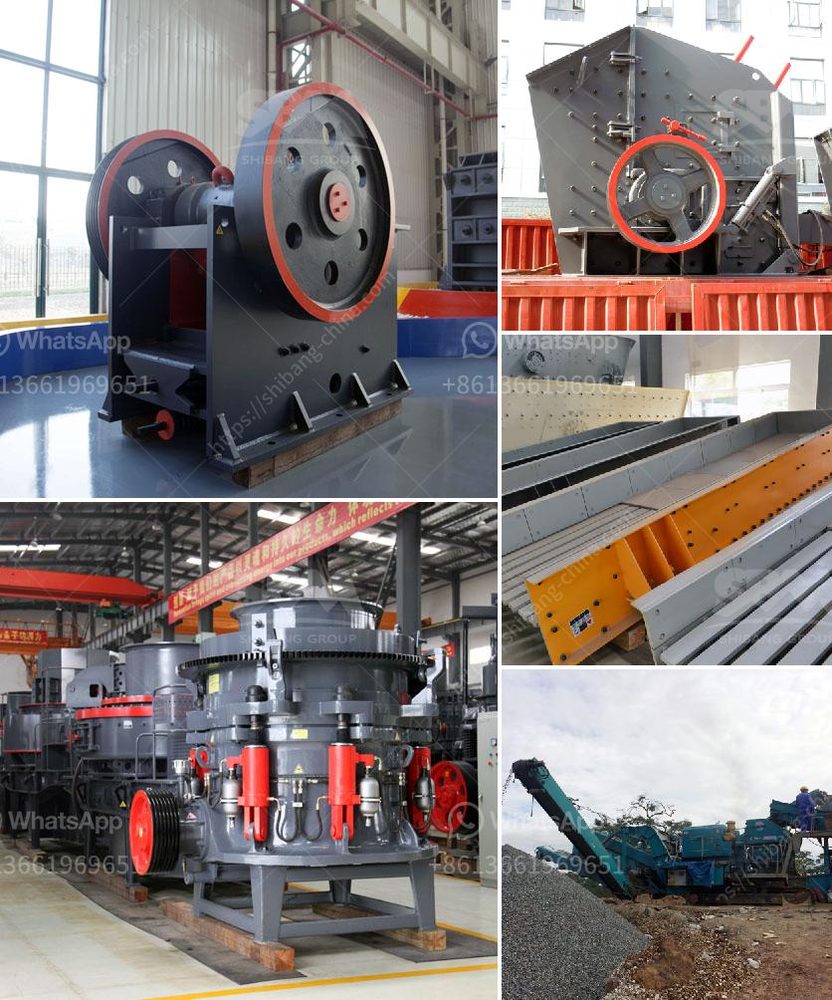

<h3>quarry jaw crusher 100tph</h3>
The quarry jaw crusher 100tph is widely used in various materials processing of mining and construction industries, such as it is suit for crushing granite, marble, basalt, limestone, quartz, cobble, iron ore, copper ore, and some other mineral and rocks. Actually, the jaw crusher machine can easily process the raw materials with large hardness into small size. Jaw crushers are classified based on the position of the pivoting swing jaw.

As a professional manufacturer of mining equipment, Zenith is able to offer all-round mining solutions for our honored customers according to their practical situations and particular requirements. We believe that Zenith will be your reliable choice for quarry jaw crusher 100tph.

The key component of the jaw crusher is the jaw plate, which serves as the main wear-resistant part. The jaw plate is made of high-quality high manganese steel, which is a wear-resistant material that can withstand the high wear and tear of the crusher. A jaw crusher uses compressive force for breaking material. This mechanical pressure is achieved by the crusher's two jaws dies, one of which is fixed while the other reciprocates.

The capacity of the quarry jaw crusher ranges from 100tph to 500tph. The 100tph capacity stone crusher plant is the most common and widely used among the medium-sized crushing projects. When processing medium-hard stones, the jaw crusher is used as the primary crusher. The primary jaw crusher can process large stones with size of 700mm-1500mm. Jaw crushing is a two-stage process, and the first stage is the primary crushing process.

Additionally, if the raw materials are hard stones, such as granite and basalt, it is a must-have device in the quarry crushing plant. Impact crusher and VSI crusher are also commonly used in the secondary crushing stage.

1. Wide Application Range: The quarry equipment is widely used in various industries, such as mining, smelting, building materials, roads, railways, water conservancy, and chemical industries.

2. High Crushing Efficiency: The quarry jaw crusher can ensure great crushing effect due to its high crushing ratio.

3. Large Capacity: The quarry jaw crusher can retain the large stone material and prevent the blockage phenomenon that occurs in the ordinary crusher.

4. Low Operating Costs: Due to its simple structure, it is easy to maintain and operate, reducing downtime and improving productivity.

5. Long Service Life: The wear-resistant parts are made of high-strength materials, ensuring the long service life and reducing customers' maintenance costs.

In conclusion, the quarry jaw crusher 100tph not only ensures the safety and efficiency of the crushing process but also expands the application range of the rocks. It is worth mentioning that, as a trusted manufacturer and supplier of mining equipment, Zenith can provide various customized options for the quarry jaw crusher to meet different production needs. Trust Zenith, and your quarry crushing plant will stand out from others!
<h3>Contact us</h3><ul><li><strong>Whatsapp:&nbsp;<a href="https://wa.me/8613661969651">+8613661969651</a></strong></li><li><a href="https://swt.shibang-china.com/?git&amp;zhl&amp;quarry jaw crusher 100tph"><strong>Online Service(chat now)</strong></a></li></ul><h3>Related</h3><ul><li><a href='powder manufacturing for quartz feldspar crusher.md'>powder manufacturing for quartz feldspar crusher</a></li><li><a href='mobile jaw crushers for sale in italy.md'>mobile jaw crushers for sale in italy</a></li><li><a href='vertical grinder mill for sale.md'>vertical grinder mill for sale</a></li><li><a href='quarry crusher machine price.md'>quarry crusher machine price</a></li><li><a href='small jaw crusher supplier.md'>small jaw crusher supplier</a></li></ul>