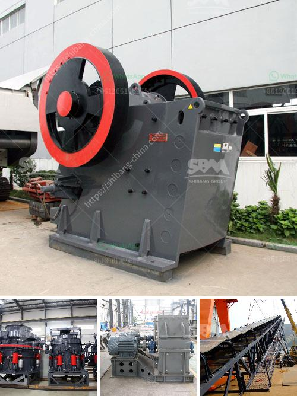

<h3>quarry machine and crusher plant sale in australia</h3>
When it comes to the construction industry, quarries play a vital role. A quarry is a huge open pit where raw materials like rocks, sand, or gravel are extracted from the surface of the earth. It's a process that involves cutting or blasting stones into smaller pieces or preparing raw materials for further processing.

In Australia, this booming industry is growing at a faster pace than ever. The potential in this industry is unlimited, and mining contractors are constantly looking for new projects, which can make this quarry machine and crusher plant sale in Australia something to look forward to.

Quality quarry products in Australia are essential for effective road construction, ensuring a steady supply of quality aggregates is vital for road maintenance, rehabilitation, and repairs. When it comes to civil construction, aggregates like sand, gravel, and crushed stone, are essential for the concrete production, asphalt production, and road construction.

Quarrying is a highly skilled and specialized operation that requires skilled workforce and high-quality equipment. The mining industry is notorious for occupational hazards, so it's essential to invest in proper safety equipment and training.

Gone are the days when quarrying was done with just a single machine. Back then, the technology was limited to blasting rocks, but now there is a wide range of machines available to carry out tasks efficiently and effectively. Crushers are one of the main equipment used for reducing rocks, stones, and ore into smaller sizes.

Crushing equipment is usually configured to break rocks into smaller pieces, so they can be used for other purposes like landscaping, road-building, or construction. With so many companies turning to quarrying, in addition to the traditional methods of quarrying, modern quarry machines come with a range of benefits such as fuel efficiency, high performance, safety features, and ease of maintenance.

Crusher plants are some of the lucrative pieces of machinery in this booming industry. With the right investment, any individual can set up a crusher plant and use it to provide a valuable service to local communities, as it helps in the construction of buildings, roads, and other infrastructure.

Australia is urbanizing at an unprecedented rate, with population growth in urban areas skyrocketing. This has created an increased demand for quarry products, and this is where an investment in a quarry machine and crusher plant sale in Australia can be beneficial to any industry.

Keep in mind though, that a crusher plant and the associated machinery will require a significant investment. It is necessary to tap into your financial resources to acquire this machinery and make sure that it is well-maintained to optimize its productivity and efficiency.

There are numerous places where you can purchase high-quality quarry machines and crusher plant in Australia. Some reputable sources can help you find a perfect option for your project, so you can tap into this booming industry.

In conclusion, quarry machine and crusher plant sale in Australia is booming. Therefore, in Australia, the construction industry is always a promising industry, country-wise undoubtedly. Therefore, companies engaged in mining must do their work even more meticulously. In addition, many other companies in other countries have increased their purchases of Australian mine and quarry supplies. That's because the products made in Australia are reliable and affordable. In the coming years, the overall investment in the Australian mining industry is experiencing an upward trend. As a result, it was not difficult to notice that many big companies are building their interests on the mainland.
<h3>Contact us</h3><ul><li><strong>Whatsapp:&nbsp;<a href="https://wa.me/8613661969651">+8613661969651</a></strong></li><li><a href="https://swt.shibang-china.com/?git&amp;zhl&amp;quarry machine and crusher plant sale in australia"><strong>Online Service(chat now)</strong></a></li></ul><h3>Related</h3><ul><li><a href='rotary kiln manufacturers in australia.md'>rotary kiln manufacturers in australia</a></li><li><a href='cost of a stone crusher machine.md'>cost of a stone crusher machine</a></li><li><a href='portable machine stone crusher machine for sale.md'>portable machine stone crusher machine for sale</a></li><li><a href='machine for production of stone gravel crusher.md'>machine for production of stone gravel crusher</a></li><li><a href='ball mill price supplier.md'>ball mill price supplier</a></li></ul>