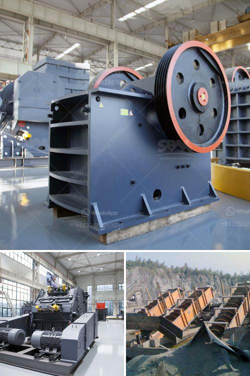

<h3>quarry plant in nigeria</h3>
Quarrying is a thriving industry in Nigeria, with millions of people relying on it for their daily sustenance. In fact, it supports the livelihood of about 10% of the country's population. However, the sector faces numerous challenges such as inadequate infrastructure, inadequate capital, and lack of modern mining techniques.

A quarry plant is a place from which dimension stone, rock, construction aggregate, gravel, or sand is extracted for commercial purposes. This is done by removing the top layer of soil or rock, known as overburden, to uncover the desired materials. These materials are then processed and used for various construction purposes, including building roads, bridges, and houses.

One of the prominent quarry plants in Nigeria is the quarry plant located in Shokunle village in Odeda Local Government Area, Ogun State. It is owned and operated by a mining company that specializes in the extraction and processing of granite, limestone, and other quarry materials.

The quarry plant in Shokunle is well-equipped with modern machinery and equipment for efficient and sustainable extraction and processing. It employs skilled workers who are trained in safe mining practices and adheres to strict environmental standards. This ensures that the quarry operates responsibly and minimizes the impact on the surrounding ecosystem.

The quarry plant in Shokunle works tirelessly to meet the increasing demand for construction materials in Nigeria. With the country's rapid population growth and urbanization, the need for infrastructure development has surged. As a result, there is a high demand for construction materials such as granite, gravel, and sand, which are all extracted from the quarry.

The quarry plant in Shokunle plays a vital role in the development of Nigeria's infrastructure. It supplies high-quality materials that are used for the construction of roads, bridges, and buildings. These materials are essential for the country's economic growth and social development.

However, despite its importance, the quarry plant in Shokunle faces several challenges. One of the major challenges is the inadequate infrastructure, particularly the poor state of the roads leading to the quarry. This hampers the transportation of materials from the quarry to the construction sites, causing delays and increased costs.

Another challenge is the lack of modern mining techniques and equipment. The quarry plant relies on manual labor for most of its operations, which is not only labor-intensive but also inefficient. Modern mining techniques such as using explosives for rock blasting and advanced machinery for material processing would significantly improve productivity and efficiency.

Additionally, the quarry plant in Shokunle faces financial constraints. The capital required for the acquisition of modern mining equipment and the expansion of the plant is often lacking. This limits the plant's capacity to meet the increasing demand for construction materials, hindering its growth and potential.

In conclusion, the quarry plant in Nigeria plays a crucial role in the country's infrastructure development. It supplies high-quality materials for the construction industry, contributing to economic growth and social development. However, it faces numerous challenges, including inadequate infrastructure, lack of modern mining techniques, and financial constraints. Efforts should be made to address these challenges and support the growth of the quarrying sector in Nigeria.
<h3>Contact us</h3><ul><li><strong>Whatsapp:&nbsp;<a href="https://wa.me/8613661969651">+8613661969651</a></strong></li><li><a href="https://swt.shibang-china.com/?git&amp;zhl&amp;quarry plant in nigeria"><strong>Online Service(chat now)</strong></a></li></ul><h3>Related</h3><ul><li><a href='cement production procedure in vertical mill.md'>cement production procedure in vertical mill</a></li><li><a href='gypsum powder suppliers in india.md'>gypsum powder suppliers in india</a></li><li><a href='crusher manufacturers in south africa.md'>crusher manufacturers in south africa</a></li><li><a href='small sand grinding machine in india.md'>small sand grinding machine in india</a></li><li><a href='powder making machine south africa.md'>powder making machine south africa</a></li></ul>