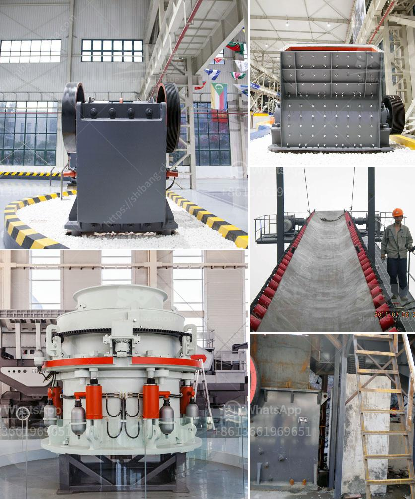

<h3>quarry stone crushers for sale</h3>
Quarry stone crushers are widely used in mining, smelting, building materials, roads, railways, water conservancy, and chemical industries and many other sectors. Commonly materials like granite, marble, basalt, iron ore, limestone, quartzite, diabase, iron ore, gold, copper, etc. all have a vast range of crushing capabilities. Quarry stone crushers for sale achieve perfect combination between crushing efficiency and operating cost. Moreover, it has a wide range of application and is particularly suitable for crushing hard rock, such as basalt, river pebbles.

For quarry stone crushers, it is advisable to adopt suitable production equipment to form a complete stone crushing plant. One complete set of crushing production line mainly includes vibrating feeder, jaw crusher, impact crusher, vibrating screen, and belt conveyor. Customers are free to consult manufacturers in selecting suitable models according to their actual needs.

Despite the various kinds of quarry stone crushers, the market demand for their production will always be high. Further, the promotion of the construction project demands for gravel aggregate will drive the demand for these crushers. On the other hand, various government policies and regulations will also have an effect on quarry stone crushers' price. Market players are expanding their businesses in untapped regions to gain a competitive advantage.

When it comes to choosing the right crusher for quarry operations, there are several factors to consider. Firstly, the type of material to be crushed should be taken into account, as it will affect the selection of the appropriate machinery. Secondly, the desired output size determines the number of stages of crushing required and the type of crushers to be used. Lastly, the budget and maintenance requirements should be kept in mind to ensure long-term profitability.

In conclusion, quarry stone crushers play a vital role in the construction industry. They have applications in various operations including crushing large stones into smaller pieces for further processing or for road and other infrastructure projects. Quarry stone crushers are also pivotal in the mining industry. Customers have different production requirements when it comes to purchasing crushers. Therefore, it is crucial to choose the right equipment that suits their needs and maximizes their ROI.
<h3>Contact us</h3><ul><li><strong>Whatsapp:&nbsp;<a href="https://wa.me/8613661969651">+8613661969651</a></strong></li><li><a href="https://swt.shibang-china.com/?git&amp;zhl&amp;quarry stone crushers for sale"><strong>Online Service(chat now)</strong></a></li></ul><h3>Related</h3><ul><li><a href='stone crushers machinery in south africa.md'>stone crushers machinery in south africa</a></li><li><a href='dolomite stone crusher plant.md'>dolomite stone crusher plant</a></li><li><a href='jaw crusher specification for activated carbon.md'>jaw crusher specification for activated carbon</a></li><li><a href='study of a fero chrome crushing plant.md'>study of a fero chrome crushing plant</a></li><li><a href='to ton hr rock crushers.md'>to ton hr rock crushers</a></li></ul>