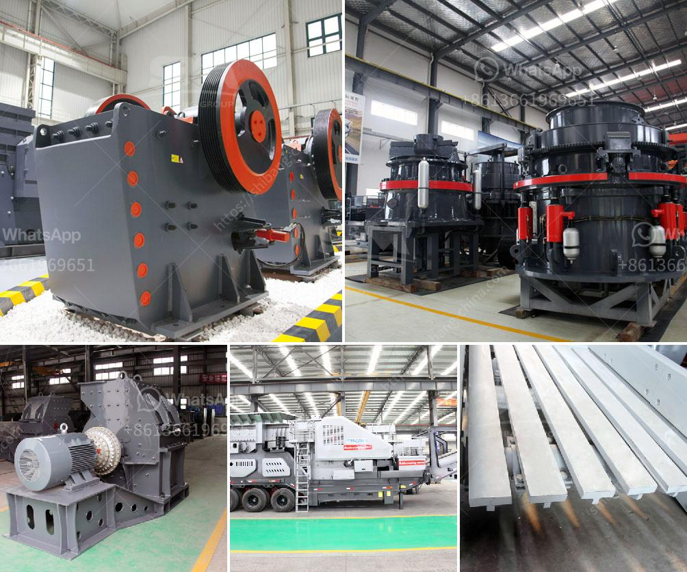

<h3>quarry stone for sale in malta</h3>
Situated in the heart of the Mediterranean, Malta is a country blessed with a rich cultural heritage and breathtaking landscapes. One such natural wonder that has captivated locals and visitors for centuries is the unique quarry stone found abundantly throughout the archipelago. Renowned for its exceptional quality and beauty, quarry stone has become a popular choice for construction and landscaping projects. With a wide range of colors, sizes, and finishes available, quarry stone brings a touch of elegance and timeless appeal to any space.

One of the primary reasons for the popularity of quarry stone in Malta is its remarkable geological origins. Formed over millions of years, this natural material is a result of sedimentary rock accumulation, blending various minerals and organic materials. The local quarries have perfected the extraction process to unveil the true beauty of the stone, showcasing stunning patterns and color variations that have become synonymous with Maltese architecture.

What sets Maltese quarry stone apart is its unique color palette. Ranging from warm honey tones to cool sand shades, the stone reflects the beautiful hues of the Maltese sun. Whether it is a traditional farmhouse, a modern villa, or a public square, quarry stone evokes a sense of timelessness and authenticity that is unrivaled. The mixture of organic materials such as seashells and fossils creates striking patterns that further enhance the character and individuality of each individual stone.

Malta's rich history also plays a significant role in the allure of quarry stone. Dating back to ancient times, this versatile stone has been used in various iconic structures around the islands. From the majestic megalithic temples to the impressive fortifications of Valletta, quarry stone has stood the test of time, showcasing its durability and resilience. By choosing quarry stone for their projects, individuals are not only embracing a piece of Malta's heritage but also investing in a material that will last for generations to come.

As the demand for quarry stone in Malta continues to rise, there are numerous suppliers across the islands offering a wide selection of stones to choose from. These suppliers have developed a reputation for their commitment to quality and customer satisfaction. They work closely with architects, contractors, and homeowners to provide the perfect stone for each unique project, ensuring that every detail is taken into consideration.

Whether used for flooring, walls, or external cladding, quarry stone offers endless possibilities for design. Its natural beauty and versatility make it a perfect choice for both traditional and contemporary settings. Its excellent thermal properties also contribute to energy efficiency, helping to maintain a comfortable indoor environment and reducing energy consumption.

In conclusion, quarry stone for sale in Malta is more than just a construction material; it is a link to the islands' history and a testament to their natural beauty. With its exceptional quality, unique color palette, and timeless appeal, quarry stone has become a staple in Maltese architecture. The availability of a wide range of colors, sizes, and finishes ensures that each project can benefit from the versatility and elegance that quarry stone brings. By choosing quarry stone, individuals are investing in a material that not only adds beauty but also stands the test of time, creating a lasting legacy of the Maltese experience.
<h3>Contact us</h3><ul><li><strong>Whatsapp:&nbsp;<a href="https://wa.me/8613661969651">+8613661969651</a></strong></li><li><a href="https://swt.shibang-china.com/?git&amp;zhl&amp;quarry stone for sale in malta"><strong>Online Service(chat now)</strong></a></li></ul><h3>Related</h3><ul><li><a href='mobile jaw crushers for sale in italy.md'>mobile jaw crushers for sale in italy</a></li><li><a href='ball milling in bangalore.md'>ball milling in bangalore</a></li><li><a href='used quarry machine germany.md'>used quarry machine germany</a></li><li><a href='equipment required for producing lime for new plant.md'>equipment required for producing lime for new plant</a></li><li><a href='continuous ball mill manufactures in gujrat.md'>continuous ball mill manufactures in gujrat</a></li></ul>