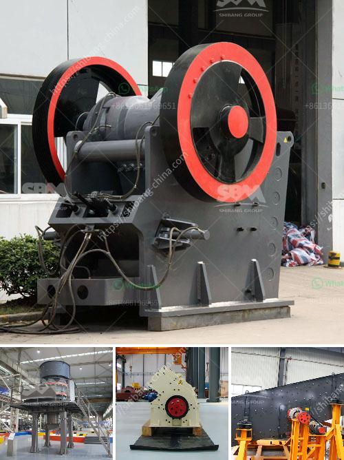

<h3>quarrying crusher in zimbia</h3>
In Zambia, the mining industry plays a crucial role in the country's economic development. Copper is the dominant mineral, accounting for more than 70% of the country's export earnings. Quarrying is the process of extracting natural resources from the earth's surface, particularly minerals, such as limestone, gravel, and granite. Quarrying crusher equipment is essential in the mining industry because the crusher breaks the rock into smaller sizes for further processing. Quarrying crusher also generates employment opportunities for people in the region, stimulating socio-economic growth.

Zambia's mining industry has been growing steadily over the years, attracting both local and foreign investors. The favorable business climate, stable political environment, and abundant mineral resources make Zambia an attractive mining destination. Quarrying in Zambia is primarily conducted in rural areas, creating jobs and bringing development to otherwise marginalized areas. The industry has become an essential backbone of many local communities, contributing to poverty reduction and improving living conditions.

Limestone is one of the significant resources obtained through quarrying in Zambia. It is widely used in the construction industry as a primary raw material for cement production. Quarries, where limestone is extracted, employ several stages of crushing and screening to obtain various sizes of the material. This is where quarrying crushers play a vital role. Crushers break down large rocks into smaller, more manageable pieces, which can be transported for further processing or used directly.

In recent years, Zambia's infrastructure development has accelerated, creating an increased demand for construction materials such as gravel and granite. These materials not only serve the construction industry but are also vital in road construction, railway development, and residential building projects. Quarrying crushers are an essential piece of machinery in the process of turning large rocks into smaller, more workable materials.

Furthermore, quarrying crushers contribute to the improvement of environmental sustainability. By processing rocks on-site, the need for long-distance transportation is reduced, decreasing carbon emissions. Additionally, crusher machines are equipped with state-of-the-art dust suppression systems and other modern technologies, which help mitigate environmental impacts associated with quarry operations.

In terms of job creation, the quarrying industry in Zambia has provided employment opportunities for a significant number of people, particularly in rural areas where unemployment rates are high. Crushers operate as part of the value chain, allowing workers to engage in various stages of the mining process, from extraction to transportation and processing. The employment generated by quarrying crushers goes beyond the direct workforce, as local communities and businesses benefit from the industry's positive spill-over effects.

To maximize the potential benefits of quarrying crusher operations in Zambia, it is essential to implement robust environmental regulations and guidelines. These mechanisms should ensure responsible mining practices that minimize negative impacts on the environment and prioritize the safety and well-being of workers. Simultaneously, the government should collaborate with mining companies and communities to develop sustainable strategies that ensure the fair distribution of the industry's benefits.

In conclusion, the quarrying crusher industry plays a critical role in Zambia's mining sector. It contributes to the country's economic growth, job creation, and infrastructure development. Through responsible mining practices and the implementation of sustainable measures, the industry can continue to thrive, ensuring that its benefits are enjoyed by all stakeholders.
<h3>Contact us</h3><ul><li><strong>Whatsapp:&nbsp;<a href="https://wa.me/8613661969651">+8613661969651</a></strong></li><li><a href="https://swt.shibang-china.com/?git&amp;zhl&amp;quarrying crusher in zimbia"><strong>Online Service(chat now)</strong></a></li></ul><h3>Related</h3><ul><li><a href='low cost jaw crusher for sale in ethiopia.md'>low cost jaw crusher for sale in ethiopia</a></li><li><a href='cost 100tph stone crusher in india.md'>cost 100tph stone crusher in india</a></li><li><a href='machine for production of stone gravel crusher.md'>machine for production of stone gravel crusher</a></li><li><a href='gravel washing plant for sale in uk.md'>gravel washing plant for sale in uk</a></li><li><a href='crusher processing machines nigeria.md'>crusher processing machines nigeria</a></li></ul>