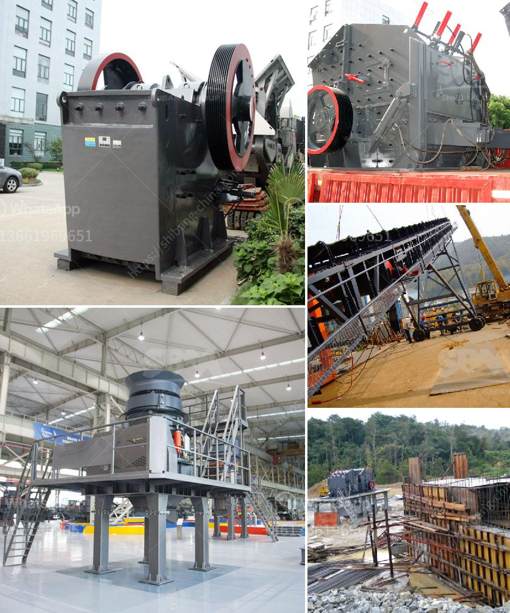

<h3>quartz ball mills hyderabad</h3>
Quartz ball mills are used in a wide range of applications in both dry and wet grinding processes. With its various models and types, it can be utilized for crushing, grinding and pulverizing different materials. Despite being referred to as a quartz ball mill, the crushing process due to its robust nature actually refers to a wide range of operations. It is a versatile machine that can process different types of materials such as cement, minerals, ores, and chemicals.

The quartz ball mill is mainly composed of the feeding part, discharging part, rotating part, transmission part (reducer, small driving gear, motor, electric control), etc. The hollow shaft is made of high-quality steel casting, while the inner lining is detachable and can be replaced easily. This ensures the longevity and durability of the mill. Additionally, the driving system adopts a closed-circuit lubrication, making it highly reliable and efficient.

One of the major advantages of quartz ball mills is their low maintenance requirements. They are designed to be compact and easily movable, allowing for convenient installation and transportation. The machine is also energy-efficient, saving both electricity and production costs. The design of the mill ensures a high grinding efficiency, providing for a uniform particle size distribution.

In Hyderabad, quartz ball mills are used in various industries such as construction, mining, chemical, and pharmaceutical. A typical application would be grinding quartz, kaolin, calcium carbonate, talc, feldspar, clay, marble, and refractory materials. The large capacity and efficiency of quartz ball mills make them an ideal choice for large industrial grinding applications. The high-quality materials used in the construction of the mill contribute to its reliability and long service life.

Hyderabad is a well-known destination for high-quality quartz ball mills. The city boasts of several manufacturers and suppliers catering to the needs of different industries. From small-scale industries to large corporate companies, there is a wide range of quartz ball mills available to suit specific requirements. These mills offer not only excellent performance but also value for money.

The demand for quartz ball mills in Hyderabad can only be expected to increase in the future. With the growth of industries such as construction and mining, the need for grinding equipment will also rise. In order to stay ahead in this competitive market, manufacturers and suppliers need to constantly upgrade their equipment and offer innovative solutions. With the right technology and continuous improvement, quartz ball mills will continue to play a crucial role in various applications.

In conclusion, quartz ball mills are an essential part of the grinding process in many industries. Their versatility, efficiency, and low maintenance requirements make them suitable for a wide range of applications. With the presence of reputable manufacturers and suppliers in Hyderabad, customers can rely on the availability of high-quality quartz ball mills. As industries continue to grow, the demand for these mills will only increase, ensuring their relevance and importance in the years to come.
<h3>Contact us</h3><ul><li><strong>Whatsapp:&nbsp;<a href="https://wa.me/8613661969651">+8613661969651</a></strong></li><li><a href="https://swt.shibang-china.com/?git&amp;zhl&amp;quartz ball mills hyderabad"><strong>Online Service(chat now)</strong></a></li></ul><h3>Related</h3><ul><li><a href='manganese crushing machine in china.md'>manganese crushing machine in china</a></li><li><a href='mobile crushing plant for sale.md'>mobile crushing plant for sale</a></li><li><a href='cobble stone machine nigeria.md'>cobble stone machine nigeria</a></li><li><a href='alwar raymond mill manufacturers.md'>alwar raymond mill manufacturers</a></li><li><a href='mobile quarry plant.md'>mobile quarry plant</a></li></ul>