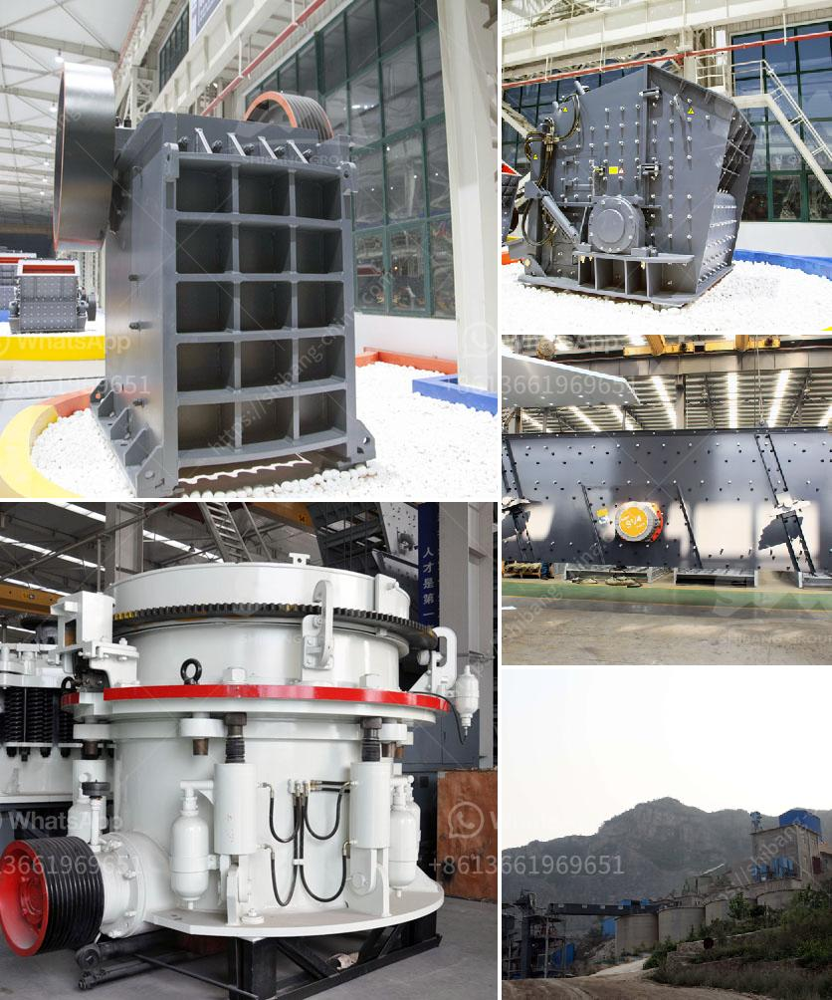

<h3>quartz crusher plant manufacturers in india</h3>
Quartz, also known as silicon dioxide, is one of the most abundant minerals on earth. It is a valuable stone used in various industries for its physical and chemical properties. In India, quartz is mainly found in the state of Rajasthan, which accounts for over 90% of the total quartz reserves in the country. Due to its high demand, quartz crusher plant manufacturers in India are finding it difficult to meet the ever-increasing demand.

Quartz crushing machine is the mining equipment designed for resizing quartz raw stones into quartz sand in the quartz crushing solution. It is also often called as quartz crusher. Quartz crushing machine features robust construction, high productivity, easy operation and maintenance and safe performance.

India is the largest consumer and producer of quartz, making it a strategically important hub for the manufacturing industry. Quartz crusher plant manufacturers in India have been more and more popular since the constant development of the nation's infrastructure. Nowadays, the Indian government starts to pay attention to the exploitation of quartz deposits. Quartz crusher plant manufacturing approach is rigorous inside the quartz sand processing equipment in addition to ordinary sandmaking machine can be because of the quartz grains being beautiful, quartz sand includes a lot of exceptional functionality, so the industry is proud of.

Quartz crusher plant manufacturers in India are playing a critical role in the production of quartz. With the increasing demand, it is crucial for manufacturers to ensure a steady supply of this mineral. As we can see, India is the largest consumer and producer of quartz, making it an essential country in the global quartz market. Crusher plant manufacturers in India need to keep up with the increasing demand for quartz to meet industry needs.
<h3>Contact us</h3><ul><li><strong>Whatsapp:&nbsp;<a href="https://wa.me/8613661969651">+8613661969651</a></strong></li><li><a href="https://swt.shibang-china.com/?git&amp;zhl&amp;quartz crusher plant manufacturers in india"><strong>Online Service(chat now)</strong></a></li></ul><h3>Related</h3><ul><li><a href='granite stone quarrying equipment.md'>granite stone quarrying equipment</a></li><li><a href='density of conveyor belts for mining.md'>density of conveyor belts for mining</a></li><li><a href='large scale mining vs small scale mining.md'>large scale mining vs small scale mining</a></li><li><a href='grinding machine activated carbon.md'>grinding machine activated carbon</a></li><li><a href='jaw crusher moby.md'>jaw crusher moby</a></li></ul>