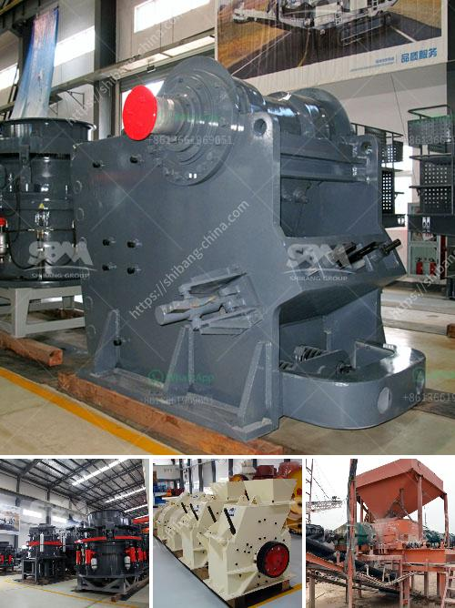

<h3>quartz grinding ball mill working</h3>
Quartz grinding ball mill is a crucial equipment for grinding after quartz crushing. It is extensively used in cement, silicate products, new construction material, refractory material, chemical fertilizer, ferrous and non-ferrous metals beneficiation and glass ceramics industries. It can grind various ores and other materials either wet or dry. 

The working principle of quartz grinding ball mill is as follows. Quartz is evenly fed into the mill by the vibrating feeder. After the quartz is crushed into small particles by the crusher, it is sent to the storage bin by the bucket elevator. Then, the material is evenly and continuously sent to the grinding chamber for grinding, and the ground material is sent to the classifier for classification.

The grinder consists of the feeding part, discharging part, turning part, and driving part (reducer, small driving gear, electric motor, and electric control). The hollow shaft is made of steel castings, the lining can be replaced, and the rotary large gear is processed by casting hobbing. The barrel in the grinding chamber is embedded with wearable liners. The materials are fed to the grinding chamber continuously through the quill shaft and crushed by the grinding media. 

The grinding media can be different types of steel balls, ceramic balls, or rods. As the barrel rotates, the material is crushed between the individual pieces of grinding media that mix and crush the product into fine powder over a period of several hours. The final fineness of the product depends on the duration of grinding, the density of the material, and the hardness of the grinding media. 

Quartz grinding ball mill has high crushing and grinding efficiency, large processing capacity, and low energy consumption. With continuous improvement and optimization of equipment structure, it has reached the advanced level in the domestic industry. Quartz grinding ball mill is suitable for grinding various ores and other materials. It is widely used in mineral processing, building materials, and chemical industries. It can be divided into dry and wet grinding methods. Users can choose the appropriate grinding equipment according to their own production needs.

In summary, quartz grinding ball mill is an important grinding equipment in the quartz production line. It has high grinding efficiency, wide application range, and low energy consumption. It is favored by users in the market. However, in the actual production process, there will be a series of problems, such as inefficient grinding, frequent maintenance, and high energy consumption. Therefore, it is necessary to carry out regular maintenance and timely repair to ensure the normal operation of the equipment and reduce production costs.
<h3>Contact us</h3><ul><li><strong>Whatsapp:&nbsp;<a href="https://wa.me/8613661969651">+8613661969651</a></strong></li><li><a href="https://swt.shibang-china.com/?git&amp;zhl&amp;quartz grinding ball mill working"><strong>Online Service(chat now)</strong></a></li></ul><h3>Related</h3><ul><li><a href='iron ore upgrading plant equipment.md'>iron ore upgrading plant equipment</a></li><li><a href='puzzolana jaw crusher price in india.md'>puzzolana jaw crusher price in india</a></li><li><a href='coal crushing and washing plant for sale south africa.md'>coal crushing and washing plant for sale south africa</a></li><li><a href='cebu supplier of disposable jaw crusher.md'>cebu supplier of disposable jaw crusher</a></li><li><a href='jaw crusher in germany used.md'>jaw crusher in germany used</a></li></ul>